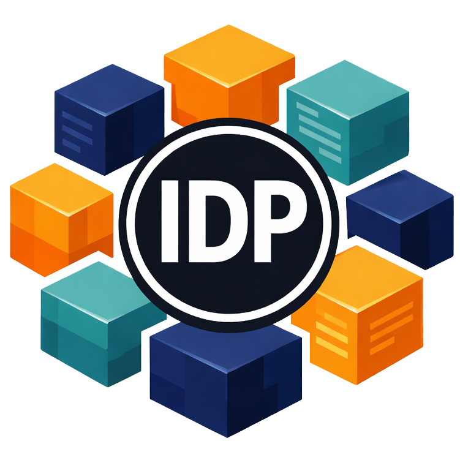
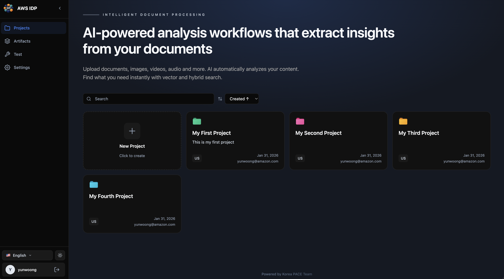
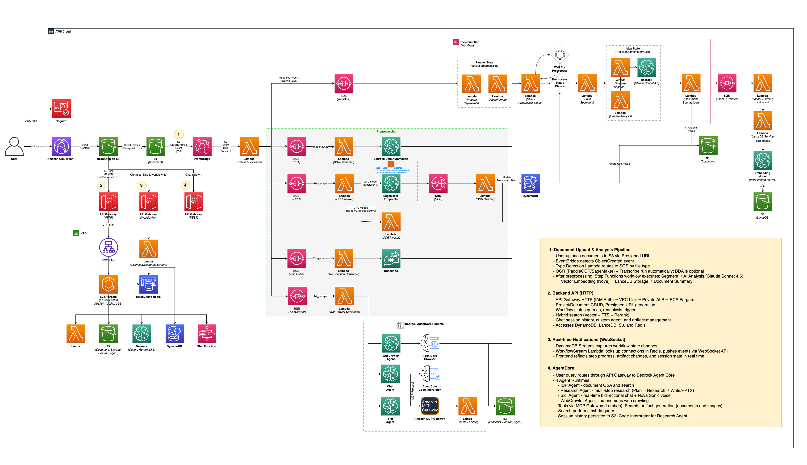

<p align="center">
  
</p>
<h1 align="center">Sample AWS IDP Pipeline</h1>

<p align="center">
  <strong>AI-powered Intelligent Document Processing (IDP) Prototype for Unstructured Data</strong>
</p>
<p align="center">
  
  
  
  
  
  
  
  
  
  
</p>

<p align="center">
  <strong>English</strong> | <a href="docs/src/content/docs/ko/index.mdx">한국어</a> | <a href="docs/src/content/docs/ja/index.mdx">日本語</a>
</p>

<p align="center">
  <a href="#features">Features</a> |
  <a href="#architecture">Architecture</a> |
  <a href="#getting-started">Getting Started</a> |
  <a href="#deployment">Deployment</a> |
  <a href="#supported-models">Models</a>
</p>

---

## Overview

An AI-powered IDP prototype that transforms unstructured data into actionable insights. Analyzes **documents, videos, audio files, and images** with hybrid search (vector + keyword), knowledge graph traversal, and a conversational AI interface. Built as an Nx monorepo with AWS CDK, featuring real-time workflow status notifications.

> [!CAUTION]
> This is a development version. Do not deploy to production.

> [!NOTE]
> This is an AWS sample project designed for experimentation, evaluation, and development purposes.

<p align="center">
  
</p>

## Features

- **Intelligent Document Processing (IDP)**
  - Document analysis with Bedrock Data Automation (BDA)
  - [OCR processing with PaddleOCR (Lambda CPU + SageMaker GPU)](docs/src/content/docs/en/ocr.md)
  - Audio/video transcription via AWS Transcribe
  - Automatic file type detection and [preprocessing pipeline routing](docs/src/content/docs/en/preprocessing.md)

- **[AI-Powered Analysis](docs/src/content/docs/en/analysis.md)**
  - Per-segment deep analysis with Claude Sonnet 4.6 Vision ReAct Agent
  - Video analysis with TwelveLabs Pegasus 1.2 + Amazon Nova Lite 2
  - Document summarization with Claude Sonnet 4.6 / Haiku 4.5
  - 1024-dimensional vector embeddings with Nova Embed

- **[Hybrid Search](docs/src/content/docs/en/vectordb.md)**
  - LanceDB vector search + Full-Text Search (FTS)
  - Lindera / ICU4X tokenizer for keyword extraction
  - Result reranking with Bedrock Cohere Rerank v3.5

- **[Knowledge Graph](docs/src/content/docs/en/graphdb.md)**
  - Neptune DB Serverless for core entity storage
  - LLM-based entity extraction (parallel per segment) + core entity normalization
  - Core entities stored in LanceDB for cross-document keyword search
  - Graph traversal and keyword graph search to discover related pages
  - Project-level and document-level graph visualization

- **[AI Chat (Agent Core)](docs/src/content/docs/en/agent.md)**
  - IDP Agent on Bedrock Agent Core
  - Tool invocation via MCP Gateway (search, graph, artifact management)
  - S3-based session management for conversation continuity
  - Custom agents with project-specific system prompts

- **Real-time Notifications**
  - Real-time status updates via WebSocket API + ElastiCache Redis
  - Workflow event detection through DynamoDB Streams
  - Live updates for step progress, artifact changes, and session state

- **Supported File Formats**

  | File Type | Supported Formats |
  |-----------|-------------------|
  | Documents | PDF, DOCX, DOC, TXT, MD |
  | Images | PNG, JPG, JPEG, GIF, TIFF, WebP |
  | Videos | MP4, MOV, AVI, MKV, WebM |
  | Audio | MP3, WAV, FLAC, M4A |
  | Presentations | PPTX, PPT |
  | CAD | DXF |
  | Web | .webreq (URL crawling) |

## Architecture



### CDK Stack Structure

```
@idp-v2/infra (15 stacks)
├── VpcStack              - VPC (10.0.0.0/16, 2 AZ, NAT Gateway)
├── NeptuneStack          - Neptune DB Serverless (knowledge graph)
├── StorageStack          - S3 buckets, DynamoDB tables, ElastiCache Redis
├── EventStack            - S3 EventBridge, SQS queues, file type detection Lambda
├── OcrStack              - PaddleOCR (Lambda CPU + SageMaker GPU)
├── BdaStack              - Bedrock Data Automation consumer
├── TranscribeStack       - AWS Transcribe consumer
├── LanceServiceStack     - LanceDB Service (Rust) + Toka tokenizer (Rust)
├── WorkflowStack         - Step Functions workflow (Distributed Map)
├── WebsocketStack        - WebSocket API, real-time notifications
├── McpStack              - MCP Gateway (search, graph traverse, keyword graph, artifact tools)
├── WorkerStack           - WebSocket message processing
├── AgentStack            - Bedrock Agent Core (IDP Agent)
├── WebcrawlerStack       - Web crawling agent (Bedrock Agent Core)
└── ApplicationStack      - Backend (ECS Fargate), Frontend (CloudFront), Cognito
```

### Core Workflows

#### 1. Document Upload & Analysis Pipeline

When a user uploads a document to S3 via Presigned URL, EventBridge detects the ObjectCreated event. The Type Detection Lambda identifies the file type and routes it to SQS. Preprocessing runs in parallel (OCR, BDA, Transcribe), and after completion, the Step Functions workflow performs segmentation, AI analysis, vector embedding, knowledge graph building, and document summarization.

```
S3 Upload (Presigned URL)
  -> EventBridge (ObjectCreated)
    -> Type Detection Lambda
      +- OCR Queue     -> PaddleOCR (Lambda/SageMaker)  -- optional
      +- BDA Queue     -> Bedrock Data Automation        -- optional
      +- Transcribe Queue -> AWS Transcribe              -- optional
      +- WebCrawler Queue -> Bedrock Agent Core          -- automatic (.webreq)
      '- Workflow Queue -> Step Functions

  -> Step Functions Workflow
      Segment Prep -> Wait for Preprocess -> Format Parser -> Build Segments
        -> Distributed Map (max 30)
            +- Segment Analyzer (Claude Sonnet 4.6 Vision / Pegasus 1.2 / Nova Lite 2)
            '- Parallel:
                +- Analysis Finalizer -> SQS -> LanceDB Writer
                +- Page Description Generator (Haiku 4.5)
                '- Entity Extractor (Haiku 4.5)
        -> Document Summarizer (Claude Sonnet 4.6)
            -> Vector Embedding (Nova 1024d) -> LanceDB
        -> Graph Builder (Core Entity Normalization + LanceDB Keywords)
            -> Neptune DB (core entities)
```

#### 2. Real-time Notifications (WebSocket)

When workflow progress is recorded in DynamoDB, DynamoDB Streams detects the changes. The WorkflowStream Lambda inside the VPC looks up active connections in Redis, then pushes events through the WebSocket API so the frontend reflects status in real time.

```
DynamoDB Streams (state change detection)
  -> WorkflowStream Lambda (VPC)
    -> Redis (connection lookup)
      -> WebSocket API -> Frontend
        +- Step progress
        +- Artifact changes
        '- Session state updates
```

#### 3. AI Chat (Agent Core)

User queries are routed through API Gateway to Bedrock Agent Core. The IDP Agent invokes tools via MCP Gateway, performing hybrid search with the Search Tool, graph traversal with the Graph Tool, and managing outputs with the Artifact Tool. Session history is persisted to S3 to maintain conversation context.

```
User Query
  -> API Gateway REST (SigV4)
    -> Bedrock Agent Core Runtime
      '- IDP Agent (Claude Sonnet 4.6)
          -> MCP Gateway
            +- Search Tool Lambda -> LanceDB Service -> Hybrid Search (Vector + FTS)
            +- Search Tool Lambda -> Graph Service   -> Neptune (graph traversal)
            +- Search Tool Lambda -> LanceDB Service -> Keyword Graph Search
            +- Artifact Tool Lambda -> S3
            '- Code Interpreter -> Python execution
          -> S3 (Session Load/Save)
```

#### 4. Backend API (HTTP)

API Gateway HTTP (IAM Auth) connects through VPC Link to a Private ALB, then to ECS Fargate running FastAPI. It handles all data access including project/document management, workflow queries, hybrid search, chat sessions, custom agents, knowledge graph, and artifact management.

```
API Gateway HTTP (IAM Auth)
  -> VPC Link -> Private ALB -> ECS Fargate (FastAPI)
    +- DynamoDB     -- Project/document CRUD, workflow status
    +- LanceDB      -- Hybrid search (Vector + FTS) via Lambda invoke
    +- Neptune      -- Knowledge graph queries
    +- Bedrock      -- Cohere Rerank v3.5
    +- S3           -- Presigned URL, sessions (DuckDB), agents, artifacts
    +- Redis        -- Query cache
    +- Step Functions -- Reanalysis trigger
    '- Lambda       -- QA Regenerator
```

### Key Design Decisions

| Decision | Rationale |
|----------|-----------|
| Step Functions payload -> DynamoDB intermediate storage | Bypass Step Functions 256KB payload limit |
| Only segment indices passed in workflow | Support for 3000+ page documents |
| LanceDB + S3 Express One Zone | Low-latency storage optimized for vector search |
| Neptune DB Serverless | Knowledge graph for entity relationships, scales to zero when idle |
| PaddleOCR dual backend (Lambda + SageMaker) | CPU model (PP-OCRv5) on Rust Lambda, GPU model (VL) on SageMaker |
| SageMaker Auto-scaling 0->1 | Cost optimization (Scale-to-zero when idle) |
| ElastiCache Redis | WebSocket connection state management (faster than DynamoDB TTL) |
| DuckDB for direct S3 queries | Query session/agent data without copying |
| VPC Link + Private ALB | Keep backend unexposed to the internet |
| Distributed Map (max 30 concurrency) | Balance between parallelism and Lambda concurrency limits |

## Getting Started

### Prerequisites

- [Node.js](https://nodejs.org/) v18+
- [pnpm](https://pnpm.io/) v8+
- [Python](https://www.python.org/) 3.12
- [AWS CLI](https://aws.amazon.com/cli/) (credentials configured)
- [AWS CDK](https://aws.amazon.com/cdk/) v2
- [mise](https://mise.jdx.dev/) (task management)

### Installation

```bash
# Clone the repository
git clone https://github.com/aws-samples/sample-aws-idp-pipeline.git
cd sample-aws-idp-pipeline

# Install dependencies
pnpm install

# Set up environment variables
cp .env.local.example .env.local
# Edit .env.local to configure your AWS profile and region
```

### Local Development

```bash
# Frontend dev server
pnpm nx serve @idp-v2/frontend

# Run agent locally
pnpm nx serve idp_v2.idp_agent
```

## Deployment

> **Quick Deploy**: Deploy the entire pipeline with a single script using CloudShell + CodeBuild. See [Quick Deploy Guide](docs/src/content/docs/en/deployment.md).

### Deploy with mise (Recommended)

```bash
# Install mise (macOS)
brew install mise

# Deploy with stack selection (via fzf)
mise run deploy

# Build all
pnpm build:all
```

### Direct CDK Deployment

```bash
# CDK bootstrap (first time only)
pnpm nx synth @idp-v2/infra

# Deploy all stacks
pnpm nx deploy @idp-v2/infra

# Hotswap deploy (dev)
pnpm nx deploy @idp-v2/infra --hotswap

# Destroy resources
pnpm nx destroy @idp-v2/infra
```

### Common Commands

```bash
# Build
pnpm build:all                              # Build all packages
pnpm nx build @idp-v2/infra                 # Build single package

# Test
pnpm nx test @idp-v2/infra                  # Run tests
pnpm nx test @idp-v2/infra --update         # Update snapshots

# Lint
pnpm nx lint @idp-v2/infra                  # Lint
pnpm nx lint @idp-v2/infra --configuration=fix  # Auto-fix
```

## Supported Models

### AI Analysis Models

| Model | Purpose | Description |
|-------|---------|-------------|
| Claude Sonnet 4.6 | Segment analysis / Agent | Vision ReAct Agent, deep document analysis |
| Claude Sonnet 4.6 | Document summarization | Overall document summary generation |
| Claude Haiku 4.5 | Search summarization | Lightweight model for search result organization |
| TwelveLabs Pegasus 1.2 | Video visual analysis | Direct video understanding and scene analysis |
| Amazon Nova Lite 2 | Video script extraction | Large-context STT-based video script extraction |
| Nova Embed Text v2 | Vector embeddings | 1024-dimensional multimodal embeddings |
| Cohere Rerank v3.5 | Search reranking | Hybrid search result optimization |

### Preprocessing Models

| Model | Purpose | Description |
|-------|---------|-------------|
| PP-OCRv5 | OCR (CPU) | Rust Lambda (MNN-based), general-purpose text extraction |
| PaddleOCR-VL | OCR (GPU) | SageMaker g5.xlarge, Vision-Language model, Auto-scaling 0->1 |
| Bedrock Data Automation | Document analysis | Async document structure analysis (optional) |
| AWS Transcribe | Speech-to-text | Audio/video text conversion |

### MCP Tools

| Tool | Description |
|------|-------------|
| summarize | Hybrid search across project documents (Vector + FTS + Rerank) |
| graph_traverse | Knowledge graph traversal from search results to discover related pages |
| graph_keyword | Keyword similarity search via LanceDB graph keywords + Neptune traversal |
| overview | Project document overview and summaries |
| save/load/edit_markdown | Create and edit markdown artifacts |
| create_pdf, extract_pdf_text/tables | PDF generation and extraction |
| create_docx, extract_docx_text/tables | Word document generation and extraction |
| generate_image | AI image generation |
| code_interpreter | Python code execution sandbox |

## Project Structure

```
sample-aws-idp-pipeline/
+-- packages/
|   +-- agents/                    # AI agents
|   |   '-- idp-agent/             # IDP Agent (Strands SDK)
|   +-- backend/app/               # FastAPI backend
|   |   +-- main.py
|   |   +-- config.py
|   |   +-- ddb/                   # DynamoDB modules
|   |   +-- routers/               # API routers
|   |   '-- services/              # Business logic
|   +-- common/constructs/src/     # Reusable CDK constructs
|   +-- frontend/src/              # React SPA
|   |   +-- routes/                # Page routes
|   |   '-- components/            # React components
|   +-- lambda/                    # MCP tool Lambdas
|   |   '-- search-mcp/            # Search tools (hybrid search, graph traverse, keyword graph)
|   '-- infra/src/
|       +-- stacks/                # 14 CDK stacks
|       +-- functions/             # Python Lambda functions
|       |   +-- step-functions/    # Workflow functions
|       |   +-- container/         # Container Lambda (LanceDB + Graph services)
|       |   +-- shared/            # Shared modules
|       |   +-- websocket/         # WebSocket handlers
|       |   '-- lancedb-writer/    # LanceDB writer
|       '-- lambda-layers/         # Lambda layers
+-- docs/                          # Documentation (Astro)
'-- README.md
```

## Backend API Endpoints

| Method | Path | Description |
|--------|------|-------------|
| GET | `/health` | Health check |
| GET/POST | `/projects` | List / create projects |
| GET/PUT/DELETE | `/projects/{id}` | Get / update / delete project |
| GET | `/projects/{id}/workflows` | List project workflows |
| POST | `/projects/{id}/documents` | Upload document (presigned URL) |
| GET/DELETE | `/projects/{id}/documents/{id}` | Get / delete document |
| GET | `/documents/{id}/workflows/{id}` | Workflow detail with segments |
| POST | `/documents/{id}/workflows/{id}/reanalyze` | Trigger reanalysis |
| POST | `.../segments/{idx}/regenerate-qa` | Regenerate Q&A for segment |
| POST | `.../segments/{idx}/add-qa` | Add Q&A to segment |
| DELETE | `.../segments/{idx}/qa/{qa_idx}` | Delete Q&A from segment |
| GET | `/chat/projects/{id}/sessions` | List chat sessions |
| GET/PATCH/DELETE | `/chat/.../sessions/{id}` | Get / rename / delete session |
| GET/POST/PUT/DELETE | `/projects/{id}/agents` | Custom agent CRUD |
| GET/DELETE | `/artifacts` | List / delete artifacts |
| GET | `/projects/{id}/graph` | Project knowledge graph |
| GET | `/projects/{id}/graph/documents/{id}` | Document-level graph |
| GET/PUT | `/prompts/system` | System prompt management |
| GET/POST/PUT | `/sagemaker/*` | SageMaker endpoint management |

## Tech Stack

### Infrastructure (TypeScript)
- AWS CDK 2.230.x + Nx 22.x
- AWS Step Functions (workflow orchestration)
- AWS Lambda + Lambda Layers
- API Gateway HTTP / REST / WebSocket

### Backend (Python)
- FastAPI (ECS Fargate, ARM64)
- LanceDB + S3 Express One Zone (vector storage)
- Neptune DB Serverless (knowledge graph)
- DynamoDB (One Table Design)
- DuckDB (direct S3 queries)

### Lambda Services (Rust)
- Lindera / ICU4X (multilingual tokenizer)
- LanceDB Service (vector search + FTS)
- PaddleOCR (MNN-based CPU inference)

### Frontend (TypeScript)
- React 19 + TanStack Router
- Tailwind CSS
- AWS SDK (S3 upload)
- Cognito OIDC authentication
- WebSocket client

### AI / ML
- Bedrock Agent Core (Strands SDK, ReAct pattern)
- Bedrock Claude Sonnet 4.6 / Haiku 4.5
- Bedrock Nova Embed (1024 dimensions)
- Bedrock Cohere Rerank v3.5
- TwelveLabs Pegasus 1.2 (video visual analysis)
- Amazon Nova Lite 2 (video script extraction)
- PaddleOCR (Lambda CPU + SageMaker GPU)
- AWS Transcribe

---

## License

This project is licensed under the [Amazon Software License](LICENSE).
