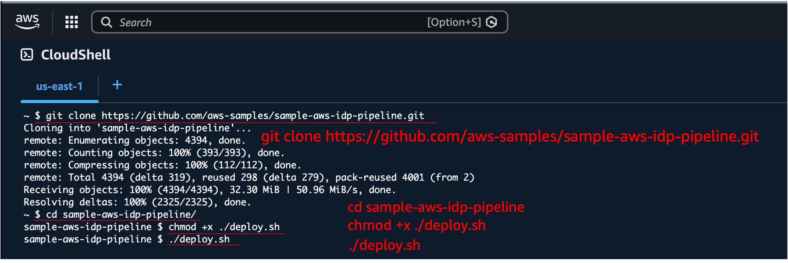
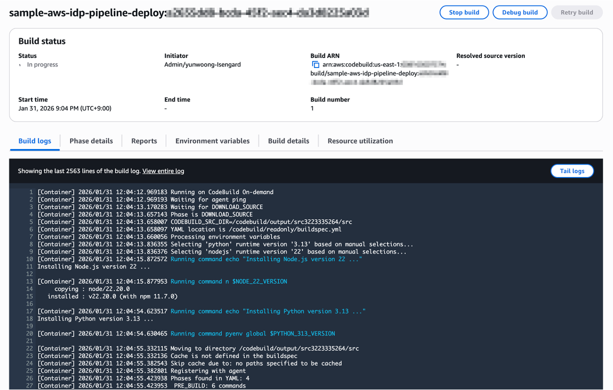
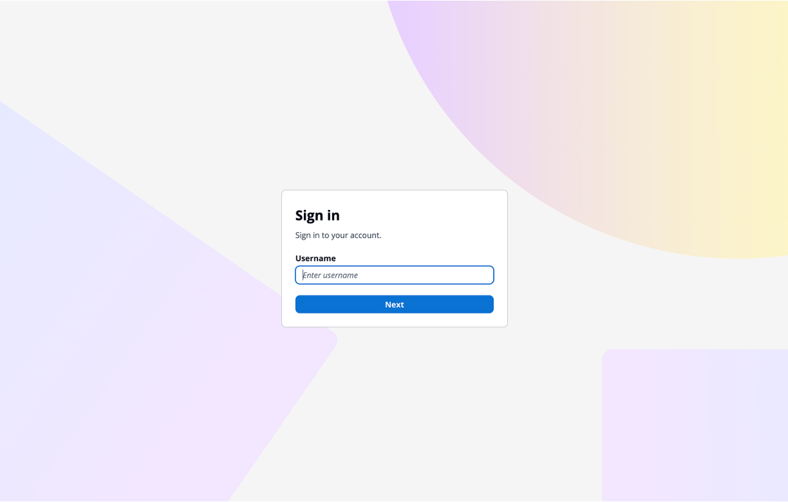

## Overview

Deploy the entire IDP pipeline automatically by running a single script (`deploy.sh`) in AWS CloudShell. The script creates a CodeBuild project via CloudFormation, and CodeBuild deploys all 12 CDK stacks sequentially.

```
Run deploy.sh (CloudShell)
  → Create CloudFormation Stack
    → Provision CodeBuild Project
      → CDK Bootstrap
        → Deploy VPC Stack
          → Deploy remaining 11 stacks in parallel (concurrency=4)
            → Create Cognito admin user
```

---

## Prerequisites

### Region Selection

Deployment is recommended in the following regions:

| Region | Notes |
|--------|-------|
| **us-east-1** (N. Virginia) | All models supported |
| **us-west-2** (Oregon) | All models supported |

---

## Deployment Steps

### Step 1. Open CloudShell

Click the CloudShell icon at the top of the AWS Console, or search for "CloudShell" in the search bar.



### Step 2. Run the Deploy Script

```bash
git clone https://github.com/aws-samples/sample-aws-idp-pipeline.git
cd sample-aws-idp-pipeline
chmod +x ./deploy.sh
./deploy.sh
```

### Step 3. Enter Admin Email

When prompted, enter the email address for the admin account. A Cognito user will be created with this email.

```
===========================================================================
  Sample AWS IDP Pipeline - Automated Deployment
---------------------------------------------------------------------------
  Deploys the full IDP pipeline via CodeBuild.

  Stacks: Vpc, Storage, Event, Bda, Ocr, Transcribe, Workflow,
          Websocket, Worker, Mcp, Agent, Application
===========================================================================

Enter admin user email address: your-email@example.com
```

### Step 4. Confirm and Start Deployment

Review the configuration and enter `y` to start deployment.

```
Configuration:
--------------
Admin Email: your-email@example.com
Repository:  https://github.com/aws-samples/sample-aws-idp-pipeline.git
Version:     main
Stack Name:  sample-aws-idp-pipeline-codebuild

Do you want to proceed with deployment? (y/N): y
```

The following steps will execute automatically:

1. Download and validate CloudFormation template
2. Create CodeBuild project (CloudFormation)
3. Start CodeBuild build
4. CDK Bootstrap (first time only)
5. Deploy 12 stacks sequentially/in parallel
6. Create Cognito admin user

---

## Monitoring Deployment

### From CloudShell

The script displays CodeBuild build progress in real-time.

```
Starting CodeBuild: sample-aws-idp-pipeline-deploy ...
Build ID: sample-aws-idp-pipeline-deploy:xxxxxxxx

You can monitor progress in the AWS Console:
  CodeBuild > Build projects > sample-aws-idp-pipeline-deploy

Phase: BUILD
```

### From CodeBuild Console

For detailed logs, check the CodeBuild project directly in the AWS Console.

> **AWS Console** > **CodeBuild** > **Build projects** > **sample-aws-idp-pipeline-deploy**



### CodeBuild Build Phases

| Phase | Description | Estimated Time |
|-------|-------------|----------------|
| INSTALL | Node.js 22, Python 3.13, pnpm, CDK, Docker QEMU setup | 2-3 min |
| PRE_BUILD | Source clone, dependency install (`pnpm install`) | 3-5 min |
| BUILD | Lint, Compile, Test, Bundle + CDK deploy (12 stacks) | 30-50 min |
| POST_BUILD | Create Cognito admin user, output URLs | 1 min |

---

## After Deployment

When deployment completes successfully, the following information is displayed.

```
===========================================================================
  Deployment Successful
===========================================================================

  Application URL: https://dxxxxxxxxxx.cloudfront.net

  Login Credentials:
     Email:              your-email@example.com
     Temporary Password: TempPass123!

  Next Steps:
     1. Access the application using the URL above
     2. Log in with the credentials
     3. Change your password when prompted

  To destroy all resources:
     aws cloudformation delete-stack --stack-name sample-aws-idp-pipeline-codebuild

===========================================================================
```

### Access and Login

1. Navigate to the **Application URL**
2. Your username is the portion before `@` in your email (e.g., `your-email@example.com` → `your-email`)
3. Log in with the temporary password `TempPass123!`
4. You will be prompted to change your password on first login



---

## Advanced Options

### Command-line Options

```bash
bash deploy.sh [OPTIONS]

Options:
  --admin-email EMAIL   Admin email (skip interactive prompt)
  --repo-url URL        Repository URL (default: github.com/aws-samples/...)
  --version VERSION     Branch or tag to deploy (default: main)
  --stack-name NAME     CloudFormation stack name (default: sample-aws-idp-pipeline-codebuild)
  --info                Show deployed application URL
  --help                Show help message
```

### Check Deployment URL

```bash
bash deploy.sh --info
```

### Deploy a Specific Version

```bash
bash deploy.sh --admin-email user@example.com --version v1.0.0
```

---

## Cleanup

### Run destroy.sh

To delete all deployed resources, run the `destroy.sh` script. Similar to deployment, it uses CodeBuild to delete all 12 stacks in reverse order.

```bash
cd sample-aws-idp-pipeline
chmod +x ./destroy.sh
./destroy.sh
```

```
===========================================================================
  Sample AWS IDP Pipeline - Automated Destroy
---------------------------------------------------------------------------
  Destroys all IDP pipeline resources via CodeBuild.

  Stacks: Application, Agent, Mcp, Worker, Websocket, Workflow,
          Transcribe, Bda, Ocr, Event, Storage, Vpc
===========================================================================

WARNING: This will permanently delete all IDP pipeline resources.

Do you want to proceed with destroy? (y/N): y
```

Once the destroy completes, the destroy CodeBuild stack is automatically cleaned up.

### If Deletion Fails

Some resources may fail to delete (e.g., S3 buckets with remaining data, ENIs still in use, etc.). In this case:

1. Go to **AWS Console** > **CloudFormation** and check for stacks in `DELETE_FAILED` status
2. Review the **Events** tab of the failed stack to identify the cause
3. Manually delete the problematic resources, then retry deleting the stack from CloudFormation

:::note
The `CDKToolkit` stack is preserved for future deployments. To fully remove it, run `aws cloudformation delete-stack --stack-name CDKToolkit`.
:::

---

## Troubleshooting

### CloudShell Session Timeout

CloudShell sessions terminate after 20 minutes of inactivity. Once CodeBuild starts, the build continues even if the CloudShell session ends. Check progress in the CodeBuild Console.

### CodeBuild Build Failure

Check the build logs:

```bash
# View recent build logs
aws logs tail /aws/codebuild/sample-aws-idp-pipeline-deploy --since 10m
```

### Common Failure Causes

| Cause | Solution |
|-------|----------|
| Bedrock model access not enabled | Enable required models in Bedrock Console |
| Service quota exceeded | Request quota increase via AWS Support |
| CDK Bootstrap failed | `aws cloudformation delete-stack --stack-name CDKToolkit` then redeploy |
| VPC limit exceeded | Delete unused VPCs or request quota increase |

---

## Deployment Architecture

```
CloudShell
  │
  ├─ deploy.sh
  │   ├─ Download CloudFormation Template (deploy-codebuild.yml)
  │   ├─ Create CloudFormation Stack
  │   │   └─ CodeBuild Project (IAM Role: PowerUserAccess + IAM)
  │   └─ Start CodeBuild Build
  │
  └─ CodeBuild (BUILD_GENERAL1_LARGE, amazonlinux 5.0)
      ├─ INSTALL:    Node.js 22, Python 3.13, pnpm, CDK, Docker QEMU (ARM64)
      ├─ PRE_BUILD:  git clone → pnpm install
      ├─ BUILD:      lint + test + bundle → CDK deploy (12 stacks)
      └─ POST_BUILD: Cognito admin user creation
```

---

## License

This project is licensed under the [Amazon Software License](https://github.com/aws-samples/sample-aws-idp-pipeline/blob/main/LICENSE).
