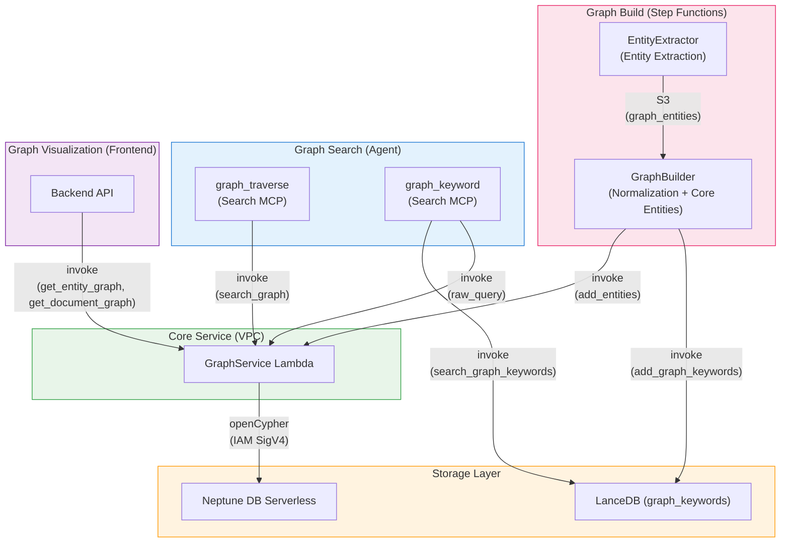

## Overview

This project uses [Amazon Neptune DB Serverless](https://docs.aws.amazon.com/neptune/latest/userguide/neptune-serverless.html) as its graph database. Core entities extracted and normalized during document analysis are stored in a knowledge graph, enabling **entity-connection-based traversal** that is difficult to achieve with vector search alone.

### Difference from Vector Search

| Aspect | Vector Search (LanceDB) | Graph Traversal (Neptune) | Keyword Graph (LanceDB + Neptune) |
|--------|------------------------|--------------------------|-----------------------------------|
| Search method | Semantic similarity | Entity relationship traversal | Keyword embedding similarity + graph traversal |
| Strength | Finding "similar content" | Discovering "connected content" from search results | Discovering pages by concept keyword |
| Input | User query | QA IDs from search results | Keyword string |
| Data | content_combined + vector embeddings | Core entity nodes + MENTIONED_IN edges | Graph keywords (name + embedding) + Neptune entities |

These search methods are used together by the agent via **Search MCP tools**:
- `search___summarize` — hybrid search on documents
- `search___graph_traverse` — graph traversal from search result QA IDs
- `search___graph_keyword` — keyword similarity search via LanceDB graph keywords

---

## Architecture

### Graph Construction (Write Path)

```
Step Functions Workflow
  → Distributed Map (max 30 concurrency)
    → SegmentAnalyzer
    → Parallel:
      +- AnalysisFinalizer (SQS → LanceDB)
      +- PageDescriptionGenerator (Haiku)
      '- EntityExtractor (Haiku) → S3 (graph_entities)
  → GraphBuilder Lambda:
    1. Collect entities from all segments (S3)
    2. Deduplicate (exact name match)
    3. Normalize → Core entities (Sonnet via Strands structured output)
    4. Store core entity names in LanceDB (add_graph_keywords)
    5. Save work files to S3 (entities.json, analyses.json)
  → GraphBatchSender (Map) → GraphService Lambda (VPC) → Neptune
```

### Graph Traverse (Read Path — from search results)

```
Agent → MCP Gateway → Search MCP Lambda (graph_traverse)
  → GraphService Lambda (VPC): search_graph (entity traversal from qa_ids)
  → LanceDB Service Lambda: Segment content retrieval
  → Bedrock Claude Haiku: Result summarization
```

### Keyword Graph Search (Read Path — from keyword)

```
Agent → MCP Gateway → Search MCP Lambda (graph_keyword)
  → LanceDB Service: search_graph_keywords (embedding similarity)
  → SHA256 hash entity names → Neptune entity ~id
  → GraphService Lambda (VPC): raw_query (find connected qa_ids)
  → LanceDB Service: get_by_qa_ids (content retrieval)
  → Bedrock Claude Haiku: Result summarization
```

### Graph Visualization (Backend API)

```
Frontend → Backend API → GraphService Lambda (VPC)
  → get_entity_graph: Project-wide entity graph
  → get_document_graph: Document-level detailed graph
```

---

## Graph Schema

Node and relationship structure stored in Neptune. Uses openCypher as the query language.

### Nodes (Labels)

| Node | Description | Key Properties |
|------|-------------|----------------|
| **Document** | Document | `id`, `project_id`, `workflow_id`, `file_name`, `file_type` |
| **Segment** | Document page/section | `id`, `project_id`, `workflow_id`, `document_id`, `segment_index` |
| **Analysis** | QA analysis result | `id`, `project_id`, `workflow_id`, `document_id`, `segment_index`, `qa_index`, `question` |
| **Entity** | Core entity (normalized) | `id`, `project_id`, `name` |

### Relationships (Edges)

| Relationship | Direction | Description |
|-------------|-----------|-------------|
| `BELONGS_TO` | Segment → Document | Segment belongs to document |
| `BELONGS_TO` | Analysis → Segment | Analysis belongs to segment |
| `NEXT` | Segment → Segment | Page order (next segment) |
| `MENTIONED_IN` | Entity → Analysis | Entity mentioned in a specific QA (`confidence`, `context`) |
| `RELATED_TO` | Document → Document | Manual document-to-document link (`reason`, `label`) |

### Node ID Design

Neptune does not support secondary indexes — the node's `~id` property is the only O(1) direct lookup mechanism. Each node type's ID is designed as a meaningful composite key, enabling fast lookups without indexes.

| Node | ID Format | Example |
|------|-----------|---------|
| **Document** | `{document_id}` | `doc_abc123` |
| **Segment** | `{workflow_id}_{segment_index:04d}` | `wf_abc123_0042` |
| **Analysis** | `{workflow_id}_{segment_index:04d}_{qa_index:02d}` | `wf_abc123_0042_00` |
| **Entity** | First 16 chars of SHA256(`{project_id}:{name}`) | `a1b2c3d4e5f6g7h8` |

- **Segment/Analysis**: Composed of workflow ID + segment index (+ QA index), so the parent relationship can be inferred from the ID alone
- **Entity**: Uses a hash of project ID + normalized name, so the same entity extracted from multiple segments is naturally merged (MERGE) into a single node

### Graph Structure Example

```
Document (report.pdf)
  ├── Segment (page 0) ──NEXT──→ Segment (page 1) ──NEXT──→ ...
  │     └── Analysis (QA 0) ←──MENTIONED_IN── Entity ("Prototyping")
  │     └── Analysis (QA 1) ←──MENTIONED_IN── Entity ("AWS")
  └── Segment (page 1)
        └── Analysis (QA 0) ←──MENTIONED_IN── Entity ("Prototyping")
        └── Analysis (QA 0) ←──MENTIONED_IN── Entity ("Innovation Flywheel")
```

Core entity "Prototyping" connects pages 0 and 1 because it was normalized from "Prototype" (page 0) and "AWS Prototyping" (page 1).

---

## Components

### 1. Neptune DB Serverless

| Item | Value |
|------|-------|
| Cluster ID | `idp-v2-neptune` |
| Engine Version | 1.4.1.0 |
| Instance Class | `db.serverless` |
| Capacity | min: 1 NCU, max: 2.5 NCU |
| Subnet | Private Isolated |
| Authentication | IAM Auth (SigV4) |
| Port | 8182 |
| Query Language | openCypher |

### 2. GraphService Lambda

A gateway Lambda that communicates directly with Neptune. Deployed inside the VPC (Private Isolated Subnet) to access the Neptune endpoint.

| Item | Value |
|------|-------|
| Function Name | `idp-v2-graph-service` |
| Runtime | Python 3.14 |
| Timeout | 5 min |
| VPC | Private Isolated Subnet |
| Authentication | IAM SigV4 (neptune-db) |

**Supported Actions:**

| Category | Action | Description |
|----------|--------|-------------|
| **Write** | `add_segment_links` | Create Document + Segment nodes, BELONGS_TO/NEXT relationships |
| | `add_analyses` | Create Analysis nodes, BELONGS_TO to Segment |
| | `add_entities` | MERGE Entity nodes, MENTIONED_IN to Analysis |
| | `link_documents` | Create bidirectional RELATED_TO between Documents |
| | `unlink_documents` | Delete RELATED_TO between Documents |
| | `delete_analysis` | Delete Analysis node + cleanup orphaned Entities |
| | `delete_by_workflow` | Delete all graph data for a workflow |
| **Read** | `search_graph` | QA ID-based graph traversal (Entity → MENTIONED_IN → related Segments) |
| | `raw_query` | Execute arbitrary openCypher query with parameters |
| | `get_entity_graph` | Project-wide entity graph query (visualization) |
| | `get_document_graph` | Document-level detailed graph query (visualization) |
| | `get_linked_documents` | Query document link relationships |

### 3. EntityExtractor Lambda (Step Functions)

Runs in parallel with AnalysisFinalizer and PageDescriptionGenerator inside the Distributed Map.

| Item | Value |
|------|-------|
| Function Name | `idp-v2-entity-extractor` |
| Runtime | Python 3.14 |
| Timeout | 5 min |
| Model | Bedrock Haiku 4.5 |
| Output | Structured (Pydantic model) |
| Stack | WorkflowStack |

**Features:**
- Extracts entities from AI analysis results using structured output
- Supports **test mode** (`mode: "test"`) that returns entities without saving to S3 (for prompt tuning)
- Saves `graph_entities` to S3 segment data

### 4. GraphBuilder Lambda (Step Functions)

Runs after Distributed Map completion and before DocumentSummarizer.

| Item | Value |
|------|-------|
| Function Name | `idp-v2-graph-builder` |
| Runtime | Python 3.14 |
| Timeout | 15 min |
| Stack | WorkflowStack |

**Processing Flow:**

1. **Create Document + Segment structure** — Create document/segment nodes and BELONGS_TO, NEXT relationships in Neptune
2. **Load segment analysis results from S3** — Collect analysis data from all segments
3. **Create Analysis nodes** — Batch create Analysis nodes per QA pair
4. **Collect entities** — Gather `graph_entities` already extracted per segment by EntityExtractor
5. **Deduplicate** — Merge identical entities by name (case-insensitive)
6. **Normalize → Core entities** — LLM groups related entities loosely (notation variants, morphological variants, conceptual containment). One entity can belong to multiple core entity groups. Core entities absorb members' mentioned_in lists.
7. **Store core entity names in LanceDB** — `add_graph_keywords` for cross-document keyword search
8. **Save work files to S3** — `entities.json` and `analyses.json` for GraphBatchSender

### 5. Search MCP Graph Tools

Graph search tools used by the AI agent, integrated into the Search MCP Lambda.

| Item | Value |
|------|-------|
| Stack | McpStack |
| Runtime | Node.js 22.x (ARM64) |
| Timeout | 5 min |

**Tools:**

| MCP Tool | Description |
|----------|-------------|
| `graph_traverse` | Traverse the graph using search result QA IDs as starting points to discover related pages |
| `graph_keyword` | Search core entities by keyword similarity in LanceDB, then find connected pages via Neptune |

**graph_traverse Flow:**

```
1. Receive qa_ids from search___summarize results
2. QA ID → Analysis node → MENTIONED_IN ← Entity node (all entities, no limit)
3. Entity → MENTIONED_IN → Other Analysis → Segment (single UNWIND query)
4. Exclude source segments, filter by document_id
5. Fetch segment content from LanceDB (get_by_segment_ids)
6. Summarize with Bedrock Claude Haiku
7. Filter sources to only Haiku-cited segments
```

**graph_keyword Flow:**

```
1. Receive keyword query
2. Search LanceDB graph_keywords by embedding similarity (top 3)
3. Hash matched entity names → Neptune entity ~id (SHA256)
4. Query Neptune: Entity → MENTIONED_IN → Analysis (get qa_ids)
5. Fetch content from LanceDB (get_by_qa_ids)
6. Summarize with Bedrock Claude Haiku
```

---

## Entity Extraction

### When Extraction Happens

Entity extraction runs in the **EntityExtractor** Lambda, parallelized per segment alongside AnalysisFinalizer and PageDescriptionGenerator. Since it runs inside Step Functions' Distributed Map, up to 30 segments extract entities concurrently.

### Extraction Method

Uses Strands Agent with Pydantic structured output for reliable JSON responses.

| Item | Value |
|------|-------|
| Model | Bedrock Haiku 4.5 |
| Framework | Strands SDK (Agent + structured_output_model) |
| Input | Segment AI analysis results + page description |
| Output | `entities[]` (Pydantic EntityExtractionResult) |

### Core Entity Normalization

After all segments are processed, GraphBuilder normalizes entities using LLM:

| Item | Value |
|------|-------|
| Model | Bedrock Sonnet 4.6 (1M context) |
| Framework | Strands SDK (Agent + structured_output_model) |
| Input | All deduplicated entities with contexts + existing LanceDB keywords |
| Output | Core entity groups (NormalizationResult) |

**Normalization rules:**
- Group liberally — over-connecting is better than missing connections
- Notation variants (spacing, punctuation, abbreviations)
- Morphological variants (singular/plural, verb/noun forms)
- Conceptual containment (a specific term contains a broader concept)
- Cross-language variants
- One entity can belong to multiple core groups
- Core entity name uses member name or well-known standard term

### Extraction Result Example

```json
{
  "entities": [
    {
      "name": "AWS Prototyping",
      "mentioned_in": [
        {
          "segment_index": 1,
          "qa_index": 0,
          "context": "AWS prototyping program and methodology"
        }
      ]
    }
  ]
}
```

### Core Entity Normalization Example

```
Input entities: Prototype (page 0), AWS Prototyping (page 1), AWS (page 0), Amazon Web Services (page 1)

Core entities:
  - "Prototyping" → [Prototype, AWS Prototyping] → connected to pages 0, 1
  - "AWS" → [AWS, Amazon Web Services, AWS Prototyping] → connected to pages 0, 1
```

---

## Infrastructure (CDK)

### NeptuneStack

```typescript
// Neptune DB Serverless Cluster
const cluster = new neptune.CfnDBCluster(this, 'NeptuneCluster', {
  dbClusterIdentifier: 'idp-v2-neptune',
  engineVersion: '1.4.1.0',
  iamAuthEnabled: true,
  serverlessScalingConfiguration: {
    minCapacity: 1,
    maxCapacity: 2.5,
  },
});

// Serverless Instance
const instance = new neptune.CfnDBInstance(this, 'NeptuneInstance', {
  dbInstanceClass: 'db.serverless',
  dbClusterIdentifier: cluster.dbClusterIdentifier!,
});
```

### Network Configuration

```
VPC (10.0.0.0/16)
  └─ Private Isolated Subnet
      ├─ Neptune DB Serverless (port 8182)
      └─ GraphService Lambda (SG: VPC CIDR → 8182 allowed)
```

Only the GraphService Lambda is deployed in the VPC. GraphBuilder Lambda and Search MCP Lambda call GraphService via Lambda invoke from outside the VPC.

### SSM Parameters

| Key | Description |
|-----|-------------|
| `/idp-v2/neptune/cluster-endpoint` | Neptune cluster endpoint |
| `/idp-v2/neptune/cluster-port` | Neptune cluster port |
| `/idp-v2/neptune/cluster-resource-id` | Neptune cluster resource ID |
| `/idp-v2/neptune/security-group-id` | Neptune security group ID |
| `/idp-v2/graph-service/function-arn` | GraphService Lambda function ARN |

---

## Component Dependency Map



| Component | Stack | Access Type | Description |
|-----------|-------|-------------|-------------|
| **GraphService** | WorkflowStack | Read/Write | Core Neptune gateway (inside VPC) |
| **EntityExtractor** | WorkflowStack | Write (S3) | Per-segment entity extraction (parallel) |
| **GraphBuilder** | WorkflowStack | Write (via GraphService + LanceDB) | Core entity normalization + graph construction |
| **graph_traverse** | McpStack | Read (via GraphService + LanceDB) | Agent graph traversal from search results |
| **graph_keyword** | McpStack | Read (via LanceDB + GraphService) | Agent keyword-based graph search |
| **Backend API** | ApplicationStack | Read (via GraphService) | Frontend graph visualization |
