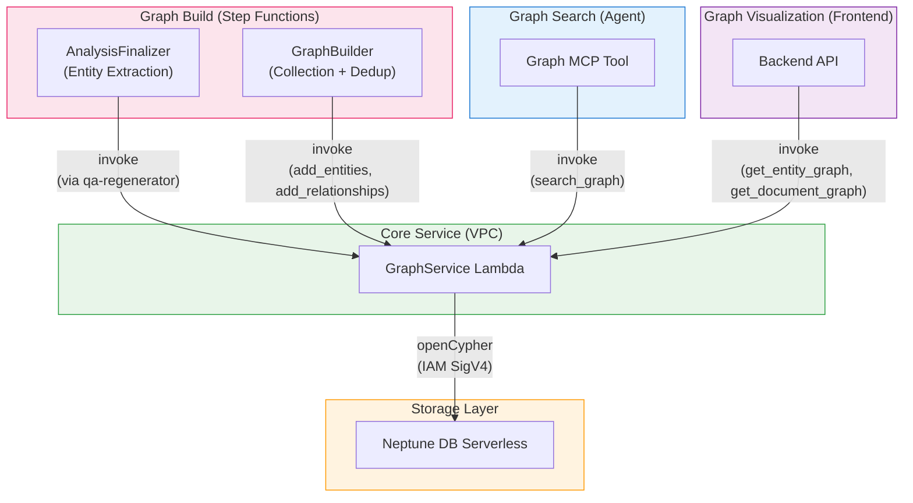

## Overview

This project uses [Amazon Neptune DB Serverless](https://docs.aws.amazon.com/neptune/latest/userguide/neptune-serverless.html) as its graph database. Entities (people, organizations, concepts, technologies, etc.) and relationships extracted during document analysis are built into a knowledge graph, enabling **entity-connection-based traversal** that is difficult to achieve with vector search alone.

### Difference from Vector Search

| Aspect | Vector Search (LanceDB) | Graph Traversal (Neptune) |
|--------|------------------------|--------------------------|
| Search method | Semantic similarity | Entity relationship graph traversal |
| Strength | Finding "similar content" | Discovering "connected content" |
| Example | Search "AI analysis" → segments with similar content | From pages mentioning "AWS Bedrock" → discover other pages where related entities appear |
| Data | content_combined + vector embeddings | Entity, relationship, and segment nodes |

These two search methods are used together by the agent via **MCP Search Tool + MCP Graph Tool**. Vector search provides initial results, and graph traversal discovers additional related pages.

---

## Architecture

### Graph Construction (Write Path)

```
Step Functions Workflow
  → Map(SegmentAnalyzer + AnalysisFinalizer)
    → AnalysisFinalizer: Entity/relationship extraction via Strands Agent (parallel per segment)
      → GraphBuilder Lambda: Collection + deduplication
        → GraphService Lambda (VPC): openCypher query execution
          → Neptune DB Serverless
```

### Graph Search (Read Path)

```
Agent → MCP Gateway → Graph MCP Lambda
  → GraphService Lambda (VPC): graph_search (entity traversal)
  → LanceDB Service Lambda: Segment content retrieval
  → Bedrock Claude Haiku: Result summarization
```

### Graph Visualization (Backend API)

```
Frontend → Backend API → GraphService Lambda (VPC)
  → get_entity_graph: Project-wide entity graph
  → get_document_graph: Document-level detailed graph
```

---

## Graph Schema

Node and relationship structure stored in Neptune. Uses openCypher as the query language.

### Nodes (Labels)

| Node | Description | Key Properties |
|------|-------------|----------------|
| **Document** | Document | `id`, `project_id`, `workflow_id`, `file_name`, `file_type` |
| **Segment** | Document page/section | `id`, `project_id`, `workflow_id`, `document_id`, `segment_index` |
| **Analysis** | QA analysis result | `id`, `project_id`, `workflow_id`, `document_id`, `segment_index`, `qa_index`, `question` |
| **Entity** | Extracted entity | `id`, `project_id`, `name`, `type` |

### Relationships (Edges)

| Relationship | Direction | Description |
|-------------|-----------|-------------|
| `BELONGS_TO` | Segment → Document | Segment belongs to document |
| `BELONGS_TO` | Analysis → Segment | Analysis belongs to segment |
| `NEXT` | Segment → Segment | Page order (next segment) |
| `MENTIONED_IN` | Entity → Analysis | Entity mentioned in a specific QA (`confidence`, `context`) |
| `RELATES_TO` | Entity → Entity | Relationship between entities (`relationship`, `source`) |
| `RELATED_TO` | Document → Document | Manual document-to-document link (`reason`, `label`) |

### Node ID Design

Neptune does not support secondary indexes — the node's `~id` property is the only O(1) direct lookup mechanism. Each node type's ID is designed as a meaningful composite key, enabling fast lookups without indexes.

| Node | ID Format | Example |
|------|-----------|---------|
| **Document** | `{document_id}` | `doc_abc123` |
| **Segment** | `{workflow_id}_{segment_index:04d}` | `wf_abc123_0042` |
| **Analysis** | `{workflow_id}_{segment_index:04d}_{qa_index:02d}` | `wf_abc123_0042_00` |
| **Entity** | First 16 chars of SHA256(`{project_id}:{name}:{type}`) | `a1b2c3d4e5f6g7h8` |

- **Segment/Analysis**: Composed of workflow ID + segment index (+ QA index), so the parent relationship can be inferred from the ID alone
- **Entity**: Uses a hash of project ID + normalized name + type, so the same entity extracted from multiple segments is naturally merged (MERGE) into a single node

### Graph Structure Example

```
Document (report.pdf)
  ├── Segment (page 0) ──NEXT──→ Segment (page 1) ──NEXT──→ ...
  │     └── Analysis (QA 1) ←──MENTIONED_IN── Entity ("AWS Bedrock", TECH)
  │     └── Analysis (QA 2) ←──MENTIONED_IN── Entity ("Claude", PRODUCT)
  │                                                  │
  │                                           RELATES_TO
  │                                                  ▼
  │                                            Entity ("Anthropic", ORG)
  └── Segment (page 1)
        └── Analysis (QA 1) ←──MENTIONED_IN── Entity ("Anthropic", ORG)
```

---

## Components

### 1. Neptune DB Serverless

| Item | Value |
|------|-------|
| Cluster ID | `idp-v2-neptune` |
| Engine Version | 1.4.1.0 |
| Instance Class | `db.serverless` |
| Capacity | min: 1 NCU, max: 2.5 NCU |
| Subnet | Private Isolated |
| Authentication | IAM Auth (SigV4) |
| Port | 8182 |
| Query Language | openCypher |

Neptune DB Serverless automatically scales based on usage and reduces cost to minimum capacity (1 NCU) when idle.

### 2. GraphService Lambda

A gateway Lambda that communicates directly with Neptune. Deployed inside the VPC (Private Isolated Subnet) to access the Neptune endpoint.

| Item | Value |
|------|-------|
| Function Name | `idp-v2-graph-service` |
| Runtime | Python 3.14 |
| Timeout | 5 min |
| VPC | Private Isolated Subnet |
| Authentication | IAM SigV4 (neptune-db) |

**Supported Actions:**

| Category | Action | Description |
|----------|--------|-------------|
| **Write** | `add_segment_links` | Create Document + Segment nodes, BELONGS_TO/NEXT relationships |
| | `add_analyses` | Create Analysis nodes, BELONGS_TO to Segment |
| | `add_entities` | MERGE Entity nodes, MENTIONED_IN to Analysis |
| | `add_relationships` | Create RELATES_TO relationships between Entities |
| | `link_documents` | Create bidirectional RELATED_TO between Documents |
| | `unlink_documents` | Delete RELATED_TO between Documents |
| | `delete_analysis` | Delete Analysis node + cleanup orphaned Entities |
| | `delete_by_workflow` | Delete all graph data for a workflow |
| **Read** | `search_graph` | QA ID-based graph traversal (Entity → RELATES_TO → related Segments) |
| | `traverse` | N-hop graph traversal |
| | `find_related_segments` | Find related segments by entity IDs |
| | `get_entity_graph` | Project-wide entity graph query (visualization) |
| | `get_document_graph` | Document-level detailed graph query (visualization) |
| | `get_linked_documents` | Query document link relationships |

### 3. GraphBuilder Lambda (Step Functions)

Runs after Map(SegmentAnalyzer) completion and before DocumentSummarizer in the Step Functions workflow.

| Item | Value |
|------|-------|
| Function Name | `idp-v2-graph-builder` |
| Runtime | Python 3.14 |
| Timeout | 15 min |
| Stack | WorkflowStack |

**Processing Flow:**

1. **Create Document + Segment structure** — Create document/segment nodes and BELONGS_TO, NEXT relationships in Neptune
2. **Load segment analysis results from S3** — Collect analysis data from all segments
3. **Create Analysis nodes** — Batch create Analysis nodes per QA pair (200 per batch)
4. **Collect Entities/Relationships** — Gather entities and relationships already extracted per segment by AnalysisFinalizer
5. **Entity deduplication** — Merge identical entities by name + type
6. **Batch save to Neptune** — Save Entities and Relationships in batches of 50, up to 10 parallel workers

### 4. Graph MCP Tool

MCP tool used by the AI agent to perform graph traversal.

| Item | Value |
|------|-------|
| Stack | McpStack |
| Runtime | Node.js 22.x (ARM64) |
| Timeout | 30s |

**Tools:**

| MCP Tool | Description |
|----------|-------------|
| `graph_search` | Traverse the graph using vector search QA IDs as starting points to discover related pages |
| `link_documents` | Create manual document-to-document links (with reason) |
| `unlink_documents` | Delete document-to-document links |
| `get_linked_documents` | Query document link relationships |

**graph_search Flow:**

```
1. Use QA IDs from vector search results as starting points
2. QA ID → Analysis node → MENTIONED_IN ← Entity node
3. Entity → RELATES_TO → Related Entity → MENTIONED_IN → Other Analysis
4. Fetch segment content from LanceDB for discovered segments
5. Summarize results with Bedrock Claude Haiku
```

---

## Entity Extraction

### When Extraction Happens

Entity extraction runs in the **AnalysisFinalizer** Lambda, parallelized per segment. Since it runs inside Step Functions' Distributed Map, up to 30 segments extract entities concurrently.

### Extraction Method

Uses Strands Agent for LLM-based entity and relationship extraction.

| Item | Value |
|------|-------|
| Model | Bedrock (configurable) |
| Framework | Strands SDK (Agent) |
| Input | Segment AI analysis results + page description |
| Output | `entities[]` + `relationships[]` (JSON) |

### Extraction Rules

- Entity names use canonical forms (e.g., "the transformer model" → "Transformer")
- Generic references are excluded (e.g., "Figure 1", "Table 2", "the author")
- Entity types in uppercase English (e.g., PERSON, ORG, CONCEPT, TECH, PRODUCT)
- Entity names, context, and relationship labels are written in the document language
- Every QA pair is guaranteed to have at least one entity connection

### Extraction Result Example

```json
{
  "entities": [
    {
      "name": "Amazon Bedrock",
      "type": "TECH",
      "mentioned_in": [
        {
          "segment_index": 0,
          "qa_index": 0,
          "confidence": 0.95,
          "context": "Used as AI model hosting platform"
        }
      ]
    }
  ],
  "relationships": [
    {
      "source": "Amazon Bedrock",
      "source_type": "TECH",
      "target": "Claude",
      "target_type": "PRODUCT",
      "relationship": "hosts"
    }
  ]
}
```

---

## Infrastructure (CDK)

### NeptuneStack

```typescript
// Neptune DB Serverless Cluster
const cluster = new neptune.CfnDBCluster(this, 'NeptuneCluster', {
  dbClusterIdentifier: 'idp-v2-neptune',
  engineVersion: '1.4.1.0',
  iamAuthEnabled: true,
  serverlessScalingConfiguration: {
    minCapacity: 1,
    maxCapacity: 2.5,
  },
});

// Serverless Instance
const instance = new neptune.CfnDBInstance(this, 'NeptuneInstance', {
  dbInstanceClass: 'db.serverless',
  dbClusterIdentifier: cluster.dbClusterIdentifier!,
});
```

### Network Configuration

```
VPC (10.0.0.0/16)
  └─ Private Isolated Subnet
      ├─ Neptune DB Serverless (port 8182)
      └─ GraphService Lambda (SG: VPC CIDR → 8182 allowed)
```

Only the GraphService Lambda is deployed in the VPC. GraphBuilder Lambda and Graph MCP Lambda call GraphService via Lambda invoke from outside the VPC.

### SSM Parameters

| Key | Description |
|-----|-------------|
| `/idp-v2/neptune/cluster-endpoint` | Neptune cluster endpoint |
| `/idp-v2/neptune/cluster-port` | Neptune cluster port |
| `/idp-v2/neptune/cluster-resource-id` | Neptune cluster resource ID |
| `/idp-v2/neptune/security-group-id` | Neptune security group ID |
| `/idp-v2/graph-service/function-arn` | GraphService Lambda function ARN |

---

## Component Dependency Map



| Component | Stack | Access Type | Description |
|-----------|-------|-------------|-------------|
| **GraphService** | WorkflowStack | Read/Write | Core Neptune gateway (inside VPC) |
| **GraphBuilder** | WorkflowStack | Write (via GraphService) | Graph construction in Step Functions |
| **AnalysisFinalizer** | WorkflowStack | Write (via GraphService) | Per-segment entity extraction + graph updates on QA regeneration |
| **Graph MCP Tool** | McpStack | Read (via GraphService) | Agent graph traversal tool |
| **Backend API** | ApplicationStack | Read (via GraphService) | Frontend graph visualization |
