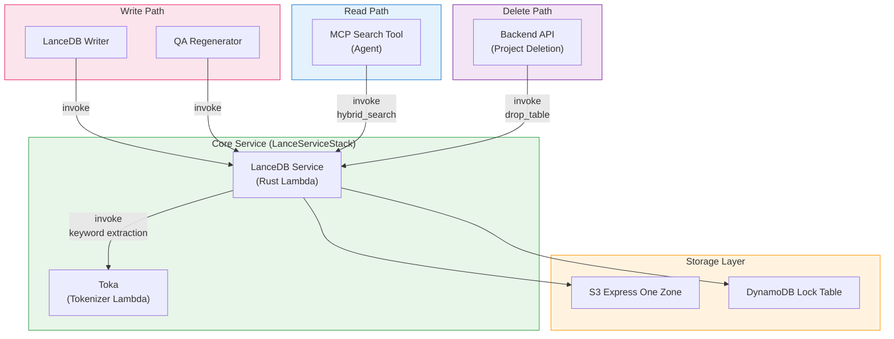

## Overview

This project uses [LanceDB](https://lancedb.com/) as the vector database instead of Amazon OpenSearch Service. LanceDB is an open-source, serverless vector database that stores data directly on S3, eliminating the need for dedicated cluster infrastructure. Combined with [Toka](https://github.com/aws-samples/sample-aws-idp-pipeline/tree/main/packages/lambda/toka), a multilingual tokenizer Lambda, it enables hybrid search (vector + full-text) across all supported languages.

### Multi-language Search Support

| Language | Semantic Search (Vector) | Full-Text Search (FTS) | Tokenizer |
|----------|:---:|:---:|-------------|
| **Korean** | O | O | Lindera (KoDic) |
| **Japanese** | O | O | Lindera (IPADIC) |
| **Chinese** | O | O | Lindera (Jieba) |
| **English and others** | O | O | ICU Word Segmenter |

Toka is a multilingual tokenizer that provides language-specific morphological analysis for CJK languages (Korean, Japanese, Chinese) and ICU-based word segmentation for all other languages. This enables hybrid search (vector + FTS) for documents in any language.

### Why LanceDB for PoC?

This project is a **PoC/prototype**, and cost efficiency is a key factor.

| Factor | OpenSearch Service | LanceDB (S3) |
|--------|-------------------|---------------|
| Infrastructure | Dedicated cluster (minimum 2-3 nodes) | No cluster needed (serverless) |
| Idle cost | Charges even when unused | S3 storage only |
| Setup complexity | Domain config, VPC, access policies | S3 bucket + DynamoDB lock table |
| Scaling | Node scaling required | Scales with S3 automatically |
| Estimated monthly cost (PoC) | $200-500+ (t3.medium x2 minimum) | $1-10 (S3 + DDB on-demand) |

:::note
OpenSearch provides richer features (dashboards, k-NN plugin, fine-grained access control) suitable for production workloads. See [Migration to OpenSearch](#migration-to-opensearch) for a transition guide.
:::

---

## Architecture

```
Write Path:
  Analysis Finalizer → SQS (Write Queue) → LanceDB Writer Lambda
    → LanceDB Service Lambda (Rust)
        ├─ Toka Lambda: keyword extraction (multilingual)
        ├─ Bedrock Nova: vector embedding (1024d)
        └─ LanceDB: store to S3 Express One Zone

Read Path:
  MCP Search Tool Lambda
    → LanceDB Service Lambda (Rust): hybrid search (vector + FTS)
    → Bedrock Claude Haiku: summarize search results

Delete Path:
  Backend API (project deletion)
    → LanceDB Service Lambda: drop_table
```

### Storage Architecture

```
S3 Express One Zone (Directory Bucket)
  └─ idp-v2/
      ├─ {project_id_1}/     ← one LanceDB table per project
      │   ├─ data/
      │   └─ indices/
      └─ {project_id_2}/
          ├─ data/
          └─ indices/

DynamoDB (Lock Table)
  PK: base_uri  |  SK: version
  └─ Manages concurrent access to LanceDB tables
```

---

## Components

### 1. LanceDB Service Lambda (Rust)

The core vector DB service, built with Rust and cargo-lambda for high performance and fast cold starts.

| Item | Value |
|------|-------|
| Function Name | `idp-v2-lance-service` |
| Runtime | Rust (provided.al2023, ARM64) |
| Memory | 1024 MB |
| Timeout | 5 min |
| Stack | LanceServiceStack |
| Build | cargo-lambda (Docker-based) |

**Supported Actions:**

| Action | Description |
|--------|-------------|
| `add_record` | Add a QA record (keyword extraction via Toka + embedding via Bedrock + store) |
| `delete_record` | Delete by QA ID or segment ID |
| `get_segments` | Retrieve all segments for a workflow |
| `get_by_segment_ids` | Retrieve content by segment ID list (used by Graph MCP) |
| `hybrid_search` | Hybrid search (vector + FTS) |
| `list_tables` | List all project tables |
| `count` | Count records in a project table |
| `delete_by_workflow` | Delete all records for a workflow |
| `drop_table` | Drop an entire project table |

### 2. Toka Lambda (Multilingual Tokenizer)

A Rust-based multilingual tokenizer Lambda that extracts keywords from text using language-specific morphological analysis.

| Item | Value |
|------|-------|
| Function Name | `idp-v2-toka` |
| Runtime | Rust (provided.al2023, ARM64) |
| Memory | 1024 MB |
| Stack | LanceServiceStack |

**Language Support:**

| Language | Library | Dictionary | Method |
|----------|---------|------------|--------|
| Korean | Lindera | KoDic | Morphological analysis, stop-tag filtering (particles, endings) |
| Japanese | Lindera | IPADIC | Morphological analysis, stop-tag filtering (particles, auxiliary verbs) |
| Chinese | Lindera | Jieba | Word segmentation, stop-word filtering (65 common words) |
| Others | ICU | - | Unicode word boundary segmentation |

**Interface:**
- Input: `{ text: string, lang: string }`
- Output: `{ tokens: string[] }`

### 3. LanceDB Writer Lambda

An SQS consumer that receives write requests from the analysis pipeline and delegates to the LanceDB Service.

| Item | Value |
|------|-------|
| Function Name | `idp-v2-lancedb-writer` |
| Runtime | Python 3.14 |
| Memory | 256 MB |
| Timeout | 5 min |
| Trigger | SQS (`idp-v2-lancedb-write-queue`) |
| Concurrency | 1 (sequential processing) |

Concurrency is set to 1 to prevent concurrent write conflicts on LanceDB tables.

### 4. MCP Search Tool

The Agent's MCP tool invokes the LanceDB Service Lambda directly to perform document retrieval during AI chat.

```
User Query → Bedrock Agent Core → MCP Gateway
  → Search Tool Lambda → LanceDB Service Lambda (hybrid_search)
    → Bedrock Claude Haiku: summarize search results → Response
```

| Item | Value |
|------|-------|
| Stack | McpStack |
| Runtime | Node.js 22.x (ARM64) |
| Timeout | 30s |
| Environment | `LANCEDB_FUNCTION_ARN` (via SSM) |

---

## Data Schema

Each QA analysis result is stored as a record. Since a single segment (page) can have multiple QAs, **records are created per QA unit**:

```rust
DocumentRecord {
    workflow_id: String,            // Workflow ID
    document_id: String,            // Document ID
    segment_id: String,             // "{workflow_id}_{segment_index:04d}"
    qa_id: String,                  // "{workflow_id}_{segment_index:04d}_{qa_index:02d}"
    segment_index: i64,             // Segment page/chapter number
    qa_index: i64,                  // QA number (starting from 0)
    question: String,               // AI-generated question
    content: String,                // content_combined (source for embedding)
    vector: FixedSizeList(f32, 1024), // Bedrock Nova embedding
    keywords: String,               // Toka-extracted keywords (FTS indexed)
    file_uri: String,               // Original file S3 URI
    file_type: String,              // MIME type
    image_uri: Option<String>,      // Segment image S3 URI
    created_at: Timestamp,          // Timestamp
}
```

- **One table per project**: Table name = `project_id`
- **Per-QA storage**: Multiple QAs per segment are stored as independent records (uniquely identified by `qa_id`)
- **`content`**: Merged text from all preprocessing (OCR + BDA + PDF text + AI analysis)
- **`vector`**: Generated by Bedrock Nova (amazon.nova-2-multimodal-embeddings-v1:0, 1024 dimensions)
- **`keywords`**: Toka-extracted keywords for FTS index, with language-specific tokenization

---

## Toka: Multilingual Tokenizer

[Toka](https://github.com/aws-samples/sample-aws-idp-pipeline/tree/main/packages/lambda/toka) is a Rust-based multilingual tokenizer Lambda that replaces the previous Korean-only Kiwi tokenizer.

### Why Toka?

LanceDB's built-in FTS tokenizer does not handle CJK languages well. CJK languages require language-specific morphological analysis for accurate keyword extraction:

```
Korean:   "인공지능 기반 문서 분석 시스템을 구축했습니다"
  Toka:   ["인공", "지능", "기반", "문서", "분석", "시스템", "구축"]

Japanese: "東京は日本の首都です"
  Toka:   ["東京", "日本", "首都"]

Chinese:  "我喜欢学习中文"
  Toka:   ["喜欢", "学习", "中文"]

English:  "Document analysis system"
  Toka:   ["Document", "analysis", "system"]
```

### CJK Tokenization (Lindera)

For Korean, Japanese, and Chinese, Toka uses **Lindera** with language-specific dictionaries and stop-tag/stop-word filters:

**Korean (KoDic):** Filters out particles (JK*), endings (EP/EF/EC), modifiers (MM), etc., keeping content words.

**Japanese (IPADIC):** Filters out particles, auxiliary verbs, symbols, and fillers, keeping content words.

**Chinese (Jieba):** Performs word segmentation, then filters 65 common stop words.

### Other Languages (ICU)

For all non-CJK languages, Toka uses the **ICU Word Segmenter** for Unicode-standard word boundary detection. Segments without alphanumeric characters are filtered out.

---

## Hybrid Search Flow

All searches are processed by the LanceDB Service Lambda. It combines vector search and full-text search using language-aware keyword extraction.

```
Search Query: "document analysis results"
  │
  ├─ [1] Toka keyword extraction (via Toka Lambda)
  │     → "document analysis results"
  │
  ├─ [2] Bedrock Nova embedding generation
  │     → 1024-dimensional vector
  │
  ├─ [3] LanceDB hybrid search
  │     → FTS: keyword matching on keywords column
  │     → Vector: nearest neighbor search on vector column
  │     → Combined results with relevance scores
  │
  └─ [4] Result summarization (MCP Search Tool Lambda)
        → Bedrock Claude Haiku generates answer from search results
```

---

## Infrastructure (CDK)

### LanceServiceStack

```typescript
// Toka Lambda (multilingual tokenizer)
const tokaFunction = new RustFunction(this, 'TokaFunction', {
  functionName: 'idp-v2-toka',
  manifestPath: '../lambda/toka',
  architecture: Architecture.ARM_64,
  memorySize: 1024,
});

// LanceDB Service Lambda (Rust)
const lanceDbServiceFunction = new RustFunction(this, 'LanceDbServiceFunction', {
  functionName: 'idp-v2-lance-service',
  manifestPath: '../lambda/lancedb-service',
  architecture: Architecture.ARM_64,
  memorySize: 1024,
  timeout: Duration.minutes(5),
  environment: {
    TOKA_FUNCTION_NAME: tokaFunction.functionName,
    LANCEDB_EXPRESS_BUCKET_NAME: '...',
    LANCEDB_LOCK_TABLE_NAME: '...',
  },
});
```

### S3 Express One Zone

```typescript
// StorageStack
const expressStorage = new CfnDirectoryBucket(this, 'LanceDbExpressStorage', {
  bucketName: `idp-v2-lancedb--use1-az4--x-s3`,
  dataRedundancy: 'SingleAvailabilityZone',
  locationName: 'use1-az4',
});
```

S3 Express One Zone provides single-digit millisecond latency, optimized for frequent read/write patterns like vector search operations.

### DynamoDB Lock Table

```typescript
// StorageStack
const lockTable = new Table(this, 'LanceDbLockTable', {
  partitionKey: { name: 'base_uri', type: AttributeType.STRING },
  sortKey: { name: 'version', type: AttributeType.NUMBER },
  billingMode: BillingMode.PAY_PER_REQUEST,
});
```

Manages distributed locking when multiple Lambda functions access the same dataset concurrently.

### SSM Parameters

| Key | Description |
|-----|-------------|
| `/idp-v2/lancedb/lock/table-name` | DynamoDB lock table name |
| `/idp-v2/lancedb/express/bucket-name` | S3 Express bucket name |
| `/idp-v2/lancedb/express/az-id` | S3 Express availability zone ID |
| `/idp-v2/lance-service/function-arn` | LanceDB Service Lambda function ARN |
| `/idp-v2/toka/function-name` | Toka tokenizer Lambda function name |

---

## Component Dependency Map

The following diagram shows all components that depend on LanceDB:



| Component | Stack | Access Type | Description |
|-----------|-------|-------------|-------------|
| **LanceDB Service** | LanceServiceStack | Read/Write | Core DB service (Rust Lambda) |
| **Toka** | LanceServiceStack | Read | Multilingual tokenizer (Rust Lambda) |
| **LanceDB Writer** | WorkflowStack | Write (via Service) | SQS consumer, delegates to Service |
| **Analysis Finalizer** | WorkflowStack | Write (via SQS/Service) | Sends segments to write queue, deletes on reanalysis |
| **QA Regenerator** | WorkflowStack | Write (via Service) | Updates Q&A segments |
| **MCP Search Tool** | McpStack | Read (direct Service invoke) | Agent tool for document retrieval |
| **Backend API** | ApplicationStack | Delete (via Service) | Invokes `drop_table` on project deletion |

---

## Migration to OpenSearch

If migrating to Amazon OpenSearch Service for production, the following components need modification:

### Components to Replace

| Component | Current (LanceDB) | Target (OpenSearch) | Scope |
|-----------|-------------------|---------------------|-------|
| **LanceDB Service Lambda** | Rust Lambda + LanceDB | OpenSearch client (CRUD + search) | Replace entirely |
| **Toka Lambda** | Rust tokenizer Lambda | Not needed (Nori handles Korean) | Remove |
| **LanceDB Writer Lambda** | SQS → invoke LanceDB Service | SQS → write to OpenSearch index | Replace invoke target |
| **MCP Search Tool** | Lambda invoke → LanceDB Service | Lambda invoke → OpenSearch search | Replace invoke target |
| **StorageStack** | S3 Express + DDB lock table | OpenSearch domain (VPC) | Replace resources |

### Components Unchanged

| Component | Reason |
|-----------|--------|
| **Analysis Finalizer** | Only sends messages to SQS (queue interface unchanged) |
| **Frontend** | No direct DB access |
| **Step Functions Workflow** | No direct LanceDB dependency |

### Migration Strategy

```
Phase 1: Replace Storage Layer
  - Create OpenSearch domain in VPC
  - Replace StorageStack resources (remove S3 Express + DDB lock)
  - Configure Nori analyzer for Korean tokenization

Phase 2: Replace Write Path
  - Modify LanceDB Service → OpenSearch indexing service
  - Update document schema (OpenSearch index mapping)
  - Add OpenSearch neural ingest pipeline for embeddings

Phase 3: Replace Read Path
  - Update MCP Search Tool Lambda invoke target to OpenSearch search service
  - Remove Toka dependency (Nori handles CJK tokenization)

Phase 4: Remove LanceDB Dependencies
  - Remove LanceServiceStack (Rust Lambdas)
  - Remove S3 Express bucket and DDB lock table
```

### Key Considerations

| Item | Notes |
|------|-------|
| CJK tokenization | OpenSearch includes [Nori analyzer](https://opensearch.org/docs/latest/analyzers/language-analyzers/#korean-nori) for Korean and built-in CJK support. Toka can be removed. |
| Vector search | OpenSearch k-NN plugin (HNSW/IVF) replaces LanceDB vector search |
| Embedding | OpenSearch neural search can auto-embed via ingest pipelines, or use pre-computed embeddings |
| Cost | OpenSearch requires a running cluster. Minimum 2-node cluster for HA. |
| SQS interface | The SQS write queue pattern can be preserved, only the consumer logic changes |
