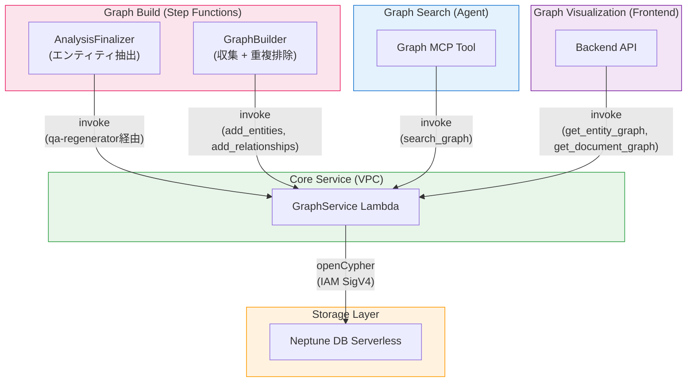

## 概要

このプロジェクトでは、[Amazon Neptune DB Serverless](https://docs.aws.amazon.com/neptune/latest/userguide/neptune-serverless.html)をグラフデータベースとして使用しています。文書分析過程で抽出されたエンティティ（人物、組織、概念、技術など）と関係をナレッジグラフとして構築し、ベクトル検索だけでは見つけにくい**エンティティ間の接続関係に基づく探索**を実現します。

### ベクトル検索との違い

| 項目 | ベクトル検索 (LanceDB) | グラフ探索 (Neptune) |
|------|----------------------|---------------------|
| 検索方式 | 意味的類似度ベース | エンティティ関係グラフ走査 |
| 強み | 「似た内容」の検索 | 「つながった内容」の探索 |
| 例 | 「AI分析」で検索 → 類似内容のセグメント | 「AWS Bedrock」が言及されたページから → 関連エンティティが登場する他のページを発見 |
| データ | content_combined + ベクトル埋め込み | エンティティ、関係、セグメントノード |

この2つの検索方式は、**MCP Search Tool + MCP Graph Tool**を通じてエージェントが併用します。ベクトル検索で初期結果を取得し、グラフ探索で関連ページを追加発見する方式です。

---

## アーキテクチャ

### グラフ構築（書き込みパス）

```
Step Functions Workflow
  → Map(SegmentAnalyzer + AnalysisFinalizer)
    → AnalysisFinalizer: Strands Agentによるエンティティ/関係抽出（セグメント単位で並列）
      → GraphBuilder Lambda: 収集 + 重複排除
        → GraphService Lambda (VPC): openCypherクエリ実行
          → Neptune DB Serverless
```

### グラフ検索（読み取りパス）

```
Agent → MCP Gateway → Graph MCP Lambda
  → GraphService Lambda (VPC): graph_search（エンティティ探索）
  → LanceDB Service Lambda: セグメント本文取得
  → Bedrock Claude Haiku: 結果要約
```

### グラフ可視化（Backend API）

```
Frontend → Backend API → GraphService Lambda (VPC)
  → get_entity_graph: プロジェクト全体のエンティティグラフ
  → get_document_graph: 文書レベルの詳細グラフ
```

---

## グラフスキーマ

Neptuneに保存されるノードと関係の構造です。クエリ言語としてopenCypherを使用します。

### ノード（Labels）

| ノード | 説明 | 主要プロパティ |
|--------|------|---------------|
| **Document** | 文書 | `id`, `project_id`, `workflow_id`, `file_name`, `file_type` |
| **Segment** | 文書ページ/セクション | `id`, `project_id`, `workflow_id`, `document_id`, `segment_index` |
| **Analysis** | QA分析結果 | `id`, `project_id`, `workflow_id`, `document_id`, `segment_index`, `qa_index`, `question` |
| **Entity** | 抽出されたエンティティ | `id`, `project_id`, `name`, `type` |

### 関係（Edges）

| 関係 | 方向 | 説明 |
|------|------|------|
| `BELONGS_TO` | Segment → Document | セグメントが文書に所属 |
| `BELONGS_TO` | Analysis → Segment | 分析がセグメントに所属 |
| `NEXT` | Segment → Segment | ページ順序（次のセグメント） |
| `MENTIONED_IN` | Entity → Analysis | エンティティが特定のQAで言及（`confidence`, `context`） |
| `RELATES_TO` | Entity → Entity | エンティティ間の関係（`relationship`, `source`） |
| `RELATED_TO` | Document → Document | 文書間の手動リンク（`reason`, `label`） |

### グラフ構造の例

```
Document (report.pdf)
  ├── Segment (page 0) ──NEXT──→ Segment (page 1) ──NEXT──→ ...
  │     └── Analysis (QA 1) ←──MENTIONED_IN── Entity ("AWS Bedrock", TECH)
  │     └── Analysis (QA 2) ←──MENTIONED_IN── Entity ("Claude", PRODUCT)
  │                                                  │
  │                                           RELATES_TO
  │                                                  ▼
  │                                            Entity ("Anthropic", ORG)
  └── Segment (page 1)
        └── Analysis (QA 1) ←──MENTIONED_IN── Entity ("Anthropic", ORG)
```

---

## コンポーネント

### 1. Neptune DB Serverless

| 項目 | 値 |
|------|-----|
| クラスターID | `idp-v2-neptune` |
| エンジンバージョン | 1.4.1.0 |
| インスタンスクラス | `db.serverless` |
| キャパシティ | min: 1 NCU, max: 2.5 NCU |
| サブネット | Private Isolated |
| 認証 | IAM Auth (SigV4) |
| ポート | 8182 |
| クエリ言語 | openCypher |

Neptune DB Serverlessは使用量に応じて自動スケーリングし、アイドル時は最小キャパシティ（1 NCU）でコストを削減します。

### 2. GraphService Lambda

Neptuneと直接通信するゲートウェイLambdaです。VPC内部（Private Isolated Subnet）に配置され、Neptuneエンドポイントにアクセスします。

| 項目 | 値 |
|------|-----|
| 関数名 | `idp-v2-graph-service` |
| ランタイム | Python 3.14 |
| タイムアウト | 5分 |
| VPC | Private Isolated Subnet |
| 認証 | IAM SigV4 (neptune-db) |

**サポートアクション：**

| カテゴリ | アクション | 説明 |
|----------|----------|------|
| **書き込み** | `add_segment_links` | Document + Segmentノード作成、BELONGS_TO/NEXT関係構築 |
| | `add_analyses` | Analysisノード作成、SegmentへBELONGS_TO接続 |
| | `add_entities` | EntityノードMERGE、AnalysisへMENTIONED_IN接続 |
| | `add_relationships` | Entity間RELATES_TO関係作成 |
| | `link_documents` | 文書間双方向RELATED_TO関係作成 |
| | `unlink_documents` | 文書間RELATED_TO関係削除 |
| | `delete_analysis` | Analysisノード削除 + 孤立Entity整理 |
| | `delete_by_workflow` | ワークフロー全体のグラフデータ削除 |
| **読み取り** | `search_graph` | QA IDベースのグラフ探索（Entity → RELATES_TO → 関連Segment） |
| | `traverse` | N-hopグラフ走査 |
| | `find_related_segments` | エンティティIDで関連セグメント探索 |
| | `get_entity_graph` | プロジェクト全体のエンティティグラフ取得（可視化） |
| | `get_document_graph` | 文書レベルの詳細グラフ取得（可視化） |
| | `get_linked_documents` | 文書間リンク関係取得 |

### 3. GraphBuilder Lambda（Step Functions）

Step FunctionsワークフローでMap(SegmentAnalyzer)完了後、DocumentSummarizerの前に実行されます。

| 項目 | 値 |
|------|-----|
| 関数名 | `idp-v2-graph-builder` |
| ランタイム | Python 3.14 |
| タイムアウト | 15分 |
| スタック | WorkflowStack |

**処理フロー：**

1. **Document + Segment構造作成** — Neptuneに文書/セグメントノードとBELONGS_TO、NEXT関係を作成
2. **S3からセグメント分析結果をロード** — 全セグメントの分析データを収集
3. **Analysisノード作成** — QAペアごとにAnalysisノードをバッチ作成（200件単位）
4. **Entity/Relationship収集** — AnalysisFinalizerでセグメントごとに抽出済みのエンティティと関係を収集
5. **Entity重複排除** — 名前 + タイプ基準で同一エンティティを統合
6. **Neptuneにバッチ保存** — EntityとRelationshipを50件単位、最大10 workersで並列保存

### 4. Graph MCP Tool

AIエージェントがグラフ探索を行う際に使用するMCPツールです。

| 項目 | 値 |
|------|-----|
| スタック | McpStack |
| ランタイム | Node.js 22.x (ARM64) |
| タイムアウト | 30秒 |

**ツール：**

| MCPツール | 説明 |
|-----------|------|
| `graph_search` | ベクトル検索のQA IDを起点にグラフを走査して関連ページを探索 |
| `link_documents` | 文書間の手動リンク作成（理由付き） |
| `unlink_documents` | 文書間リンク削除 |
| `get_linked_documents` | 文書リンク関係取得 |

**graph_searchの動作方式：**

```
1. ベクトル検索結果のQA IDを起点として使用
2. QA ID → Analysisノード → MENTIONED_IN ← Entityノード探索
3. Entity → RELATES_TO → 関連Entity → MENTIONED_IN → 他のAnalysis探索
4. 発見されたセグメントの本文をLanceDBから取得
5. Bedrock Claude Haikuで結果を要約
```

---

## エンティティ抽出

### 抽出タイミング

エンティティ抽出は**AnalysisFinalizer** Lambdaでセグメントごとに並列実行されます。Step FunctionsのDistributed Map内で実行されるため、最大30セグメントが同時にエンティティを抽出します。

### 抽出方式

Strands Agentを使用してLLMベースでエンティティと関係を抽出します。

| 項目 | 値 |
|------|-----|
| モデル | Bedrock（設定可能） |
| フレームワーク | Strands SDK (Agent) |
| 入力 | セグメントのAI分析結果 + ページ説明 |
| 出力 | `entities[]` + `relationships[]` (JSON) |

### 抽出ルール

- エンティティ名は正規化形式を使用（例："the transformer model" → "Transformer"）
- 一般的な参照は除外（例："Figure 1", "Table 2", "the author"）
- エンティティタイプは英語大文字（例：PERSON, ORG, CONCEPT, TECH, PRODUCT）
- エンティティ名、コンテキスト、関係ラベルは文書の言語で記述
- 各QAペアに少なくとも1つのエンティティ接続を保証

### 抽出結果の例

```json
{
  "entities": [
    {
      "name": "Amazon Bedrock",
      "type": "TECH",
      "mentioned_in": [
        {
          "segment_index": 0,
          "qa_index": 0,
          "confidence": 0.95,
          "context": "AIモデルホスティングプラットフォームとして使用"
        }
      ]
    }
  ],
  "relationships": [
    {
      "source": "Amazon Bedrock",
      "source_type": "TECH",
      "target": "Claude",
      "target_type": "PRODUCT",
      "relationship": "ホスティング"
    }
  ]
}
```

---

## インフラ（CDK）

### NeptuneStack

```typescript
// Neptune DB Serverless Cluster
const cluster = new neptune.CfnDBCluster(this, 'NeptuneCluster', {
  dbClusterIdentifier: 'idp-v2-neptune',
  engineVersion: '1.4.1.0',
  iamAuthEnabled: true,
  serverlessScalingConfiguration: {
    minCapacity: 1,
    maxCapacity: 2.5,
  },
});

// Serverless Instance
const instance = new neptune.CfnDBInstance(this, 'NeptuneInstance', {
  dbInstanceClass: 'db.serverless',
  dbClusterIdentifier: cluster.dbClusterIdentifier!,
});
```

### ネットワーク構成

```
VPC (10.0.0.0/16)
  └─ Private Isolated Subnet
      ├─ Neptune DB Serverless (port 8182)
      └─ GraphService Lambda (SG: VPC CIDR → 8182 許可)
```

GraphService LambdaのみVPCに配置され、GraphBuilder LambdaとGraph MCP LambdaはVPC外部からGraphServiceをLambda invokeで呼び出します。

### SSMパラメータ

| キー | 説明 |
|------|------|
| `/idp-v2/neptune/cluster-endpoint` | Neptuneクラスターエンドポイント |
| `/idp-v2/neptune/cluster-port` | Neptuneクラスターポート |
| `/idp-v2/neptune/cluster-resource-id` | NeptuneクラスターリソースID |
| `/idp-v2/neptune/security-group-id` | NeptuneセキュリティグループID |
| `/idp-v2/graph-service/function-arn` | GraphService Lambda関数ARN |

---

## コンポーネント依存関係マップ



| コンポーネント | スタック | アクセスタイプ | 説明 |
|-------------|---------|-------------|------|
| **GraphService** | WorkflowStack | 読み取り/書き込み | コアNeptuneゲートウェイ（VPC内部） |
| **GraphBuilder** | WorkflowStack | 書き込み（GraphService経由） | Step Functionsでグラフ構築 |
| **AnalysisFinalizer** | WorkflowStack | 書き込み（GraphService経由） | セグメント単位エンティティ抽出 + QA再生成時グラフ更新 |
| **Graph MCP Tool** | McpStack | 読み取り（GraphService経由） | エージェントグラフ探索ツール |
| **Backend API** | ApplicationStack | 読み取り（GraphService経由） | フロントエンドグラフ可視化 |
