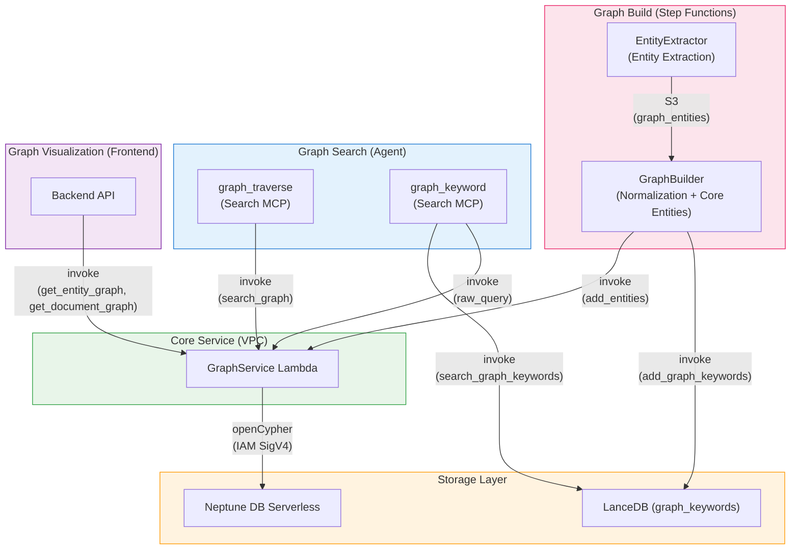

## 概要

本プロジェクトでは、グラフデータベースとして [Amazon Neptune DB Serverless](https://docs.aws.amazon.com/neptune/latest/userguide/neptune-serverless.html) を使用しています。ドキュメント分析時に抽出・正規化されたコアエンティティをナレッジグラフに保存し、ベクトル検索だけでは実現が難しい**エンティティ接続ベースのトラバーサル**を可能にしています。

### ベクトル検索との違い

| 観点 | ベクトル検索 (LanceDB) | グラフトラバーサル (Neptune) | キーワードグラフ (LanceDB + Neptune) |
|--------|------------------------|--------------------------|-----------------------------------|
| 検索方法 | セマンティック類似度 | エンティティ関係トラバーサル | キーワード埋め込み類似度 + グラフトラバーサル |
| 強み | 「類似コンテンツ」の発見 | 検索結果から「関連コンテンツ」の発見 | コンセプトキーワードによるページの発見 |
| 入力 | ユーザークエリ | 検索結果のQA ID | キーワード文字列 |
| データ | content_combined + vector embeddings | コアエンティティノード + MENTIONED_IN エッジ | グラフキーワード (name + embedding) + Neptune エンティティ |

これらの検索方法は、エージェントが **Search MCP ツール** を通じて併用します:
- `search___summarize` — ドキュメントに対するハイブリッド検索
- `search___graph_traverse` — 検索結果のQA IDからのグラフトラバーサル
- `search___graph_keyword` — LanceDB グラフキーワードによるキーワード類似検索

---

## アーキテクチャ

### グラフ構築 (書き込みパス)

```
Step Functions Workflow
  → Distributed Map (max 30 concurrency)
    → SegmentAnalyzer
    → Parallel:
      +- AnalysisFinalizer (SQS → LanceDB)
      +- PageDescriptionGenerator (Haiku)
      '- EntityExtractor (Haiku) → S3 (graph_entities)
  → GraphBuilder Lambda:
    1. Collect entities from all segments (S3)
    2. Deduplicate (exact name match)
    3. Normalize → Core entities (Sonnet via Strands structured output)
    4. Store core entity names in LanceDB (add_graph_keywords)
    5. Save work files to S3 (entities.json, analyses.json)
  → GraphBatchSender (Map) → GraphService Lambda (VPC) → Neptune
```

### グラフトラバーサル (読み取りパス — 検索結果から)

```
Agent → MCP Gateway → Search MCP Lambda (graph_traverse)
  → GraphService Lambda (VPC): search_graph (entity traversal from qa_ids)
  → LanceDB Service Lambda: Segment content retrieval
  → Bedrock Claude Haiku: Result summarization
```

### キーワードグラフ検索 (読み取りパス — キーワードから)

```
Agent → MCP Gateway → Search MCP Lambda (graph_keyword)
  → LanceDB Service: search_graph_keywords (embedding similarity)
  → SHA256 hash entity names → Neptune entity ~id
  → GraphService Lambda (VPC): raw_query (find connected qa_ids)
  → LanceDB Service: get_by_qa_ids (content retrieval)
  → Bedrock Claude Haiku: Result summarization
```

### グラフ可視化 (Backend API)

```
Frontend → Backend API → GraphService Lambda (VPC)
  → get_entity_graph: Project-wide entity graph
  → get_document_graph: Document-level detailed graph
```

---

## グラフスキーマ

Neptune に保存されるノードとリレーションシップの構造です。クエリ言語として openCypher を使用しています。

### ノード (ラベル)

| ノード | 説明 | 主要プロパティ |
|------|-------------|----------------|
| **Document** | ドキュメント | `id`, `project_id`, `workflow_id`, `file_name`, `file_type` |
| **Segment** | ドキュメントのページ/セクション | `id`, `project_id`, `workflow_id`, `document_id`, `segment_index` |
| **Analysis** | QA分析結果 | `id`, `project_id`, `workflow_id`, `document_id`, `segment_index`, `qa_index`, `question` |
| **Entity** | コアエンティティ (正規化済み) | `id`, `project_id`, `name` |

### リレーションシップ (エッジ)

| リレーションシップ | 方向 | 説明 |
|-------------|-----------|-------------|
| `BELONGS_TO` | Segment → Document | セグメントがドキュメントに所属 |
| `BELONGS_TO` | Analysis → Segment | 分析がセグメントに所属 |
| `NEXT` | Segment → Segment | ページ順序 (次のセグメント) |
| `MENTIONED_IN` | Entity → Analysis | エンティティが特定のQAで言及 (`confidence`, `context`) |
| `RELATED_TO` | Document → Document | 手動のドキュメント間リンク (`reason`, `label`) |

### ノード ID 設計

Neptune はセカンダリインデックスをサポートしていないため、ノードの `~id` プロパティが唯一のO(1)直接ルックアップ手段です。各ノードタイプのIDは意味のある複合キーとして設計されており、インデックスなしでも高速な検索が可能です。

| ノード | ID形式 | 例 |
|------|-----------|---------|
| **Document** | `{document_id}` | `doc_abc123` |
| **Segment** | `{workflow_id}_{segment_index:04d}` | `wf_abc123_0042` |
| **Analysis** | `{workflow_id}_{segment_index:04d}_{qa_index:02d}` | `wf_abc123_0042_00` |
| **Entity** | SHA256(`{project_id}:{name}`) の先頭16文字 | `a1b2c3d4e5f6g7h8` |

- **Segment/Analysis**: ワークフローID + セグメントインデックス (+ QAインデックス) で構成されているため、IDだけで親子関係を推測可能
- **Entity**: プロジェクトID + 正規化名のハッシュを使用するため、複数セグメントから抽出された同一エンティティが自然に単一ノードにマージ (MERGE) される

### グラフ構造の例

```
Document (report.pdf)
  ├── Segment (page 0) ──NEXT──→ Segment (page 1) ──NEXT──→ ...
  │     └── Analysis (QA 0) ←──MENTIONED_IN── Entity ("Prototyping")
  │     └── Analysis (QA 1) ←──MENTIONED_IN── Entity ("AWS")
  └── Segment (page 1)
        └── Analysis (QA 0) ←──MENTIONED_IN── Entity ("Prototyping")
        └── Analysis (QA 0) ←──MENTIONED_IN── Entity ("Innovation Flywheel")
```

コアエンティティ「Prototyping」は、ページ0の「Prototype」とページ1の「AWS Prototyping」から正規化されたため、ページ0とページ1を接続しています。

---

## コンポーネント

### 1. Neptune DB Serverless

| 項目 | 値 |
|------|-------|
| クラスター ID | `idp-v2-neptune` |
| エンジンバージョン | 1.4.1.0 |
| インスタンスクラス | `db.serverless` |
| キャパシティ | 最小: 1 NCU, 最大: 2.5 NCU |
| サブネット | Private Isolated |
| 認証 | IAM Auth (SigV4) |
| ポート | 8182 |
| クエリ言語 | openCypher |

### 2. GraphService Lambda

Neptune と直接通信するゲートウェイ Lambda です。Neptune エンドポイントにアクセスするため、VPC (Private Isolated Subnet) 内にデプロイされています。

| 項目 | 値 |
|------|-------|
| 関数名 | `idp-v2-graph-service` |
| ランタイム | Python 3.14 |
| タイムアウト | 5分 |
| VPC | Private Isolated Subnet |
| 認証 | IAM SigV4 (neptune-db) |

**サポートされるアクション:**

| カテゴリ | アクション | 説明 |
|----------|--------|-------------|
| **書き込み** | `add_segment_links` | Document + Segment ノードの作成、BELONGS_TO/NEXT リレーションシップの作成 |
| | `add_analyses` | Analysis ノードの作成、Segment への BELONGS_TO |
| | `add_entities` | Entity ノードの MERGE、Analysis への MENTIONED_IN |
| | `link_documents` | Document 間の双方向 RELATED_TO の作成 |
| | `unlink_documents` | Document 間の RELATED_TO の削除 |
| | `delete_analysis` | Analysis ノードの削除 + 孤立した Entity のクリーンアップ |
| | `delete_by_workflow` | ワークフローの全グラフデータの削除 |
| **読み取り** | `search_graph` | QA IDベースのグラフトラバーサル (Entity → MENTIONED_IN → 関連 Segment) |
| | `raw_query` | 任意の openCypher クエリをパラメータ付きで実行 |
| | `get_entity_graph` | プロジェクト全体のエンティティグラフクエリ (可視化用) |
| | `get_document_graph` | ドキュメントレベルの詳細グラフクエリ (可視化用) |
| | `get_linked_documents` | ドキュメントリンク関係のクエリ |

### 3. EntityExtractor Lambda (Step Functions)

Distributed Map 内で AnalysisFinalizer および PageDescriptionGenerator と並列に実行されます。

| 項目 | 値 |
|------|-------|
| 関数名 | `idp-v2-entity-extractor` |
| ランタイム | Python 3.14 |
| タイムアウト | 5分 |
| モデル | Bedrock Haiku 4.5 |
| 出力 | 構造化出力 (Pydantic モデル) |
| スタック | WorkflowStack |

**機能:**
- 構造化出力を使用してAI分析結果からエンティティを抽出
- S3に保存せずにエンティティを返す**テストモード** (`mode: "test"`) をサポート (プロンプトチューニング用)
- `graph_entities` をS3セグメントデータに保存

### 4. GraphBuilder Lambda (Step Functions)

Distributed Map の完了後、DocumentSummarizer の前に実行されます。

| 項目 | 値 |
|------|-------|
| 関数名 | `idp-v2-graph-builder` |
| ランタイム | Python 3.14 |
| タイムアウト | 15分 |
| スタック | WorkflowStack |

**処理フロー:**

1. **Document + Segment 構造の作成** — Neptune にドキュメント/セグメントノードと BELONGS_TO, NEXT リレーションシップを作成
2. **S3からセグメント分析結果を読み込み** — 全セグメントの分析データを収集
3. **Analysis ノードの作成** — QAペアごとに Analysis ノードをバッチ作成
4. **エンティティの収集** — EntityExtractor がセグメントごとに抽出済みの `graph_entities` を収集
5. **重複排除** — 同一名のエンティティをマージ (大文字小文字を区別しない)
6. **正規化 → コアエンティティ** — LLMが関連エンティティを緩やかにグループ化 (表記揺れ、形態素変化、概念的包含)。1つのエンティティが複数のコアエンティティグループに所属可能。コアエンティティはメンバーの mentioned_in リストを吸収
7. **コアエンティティ名を LanceDB に保存** — ドキュメント横断キーワード検索のための `add_graph_keywords`
8. **作業ファイルをS3に保存** — GraphBatchSender 用の `entities.json` と `analyses.json`

### 5. Search MCP グラフツール

AIエージェントが使用するグラフ検索ツールで、Search MCP Lambda に統合されています。

| 項目 | 値 |
|------|-------|
| スタック | McpStack |
| ランタイム | Node.js 22.x (ARM64) |
| タイムアウト | 5分 |

**ツール:**

| MCP ツール | 説明 |
|----------|-------------|
| `graph_traverse` | 検索結果のQA IDを起点としてグラフをトラバーサルし、関連ページを発見 |
| `graph_keyword` | LanceDB でキーワード類似度によりコアエンティティを検索し、Neptune 経由で接続されたページを発見 |

**graph_traverse フロー:**

```
1. Receive qa_ids from search___summarize results
2. QA ID → Analysis node → MENTIONED_IN ← Entity node (all entities, no limit)
3. Entity → MENTIONED_IN → Other Analysis → Segment (single UNWIND query)
4. Exclude source segments, filter by document_id
5. Fetch segment content from LanceDB (get_by_segment_ids)
6. Summarize with Bedrock Claude Haiku
7. Filter sources to only Haiku-cited segments
```

**graph_keyword フロー:**

```
1. Receive keyword query
2. Search LanceDB graph_keywords by embedding similarity (top 3)
3. Hash matched entity names → Neptune entity ~id (SHA256)
4. Query Neptune: Entity → MENTIONED_IN → Analysis (get qa_ids)
5. Fetch content from LanceDB (get_by_qa_ids)
6. Summarize with Bedrock Claude Haiku
```

---

## エンティティ抽出

### 抽出タイミング

エンティティ抽出は **EntityExtractor** Lambda で実行され、AnalysisFinalizer および PageDescriptionGenerator と並列にセグメントごとに処理されます。Step Functions の Distributed Map 内で実行されるため、最大30セグメントが同時にエンティティを抽出します。

### 抽出方法

信頼性の高いJSONレスポンスを得るために、Strands Agent と Pydantic 構造化出力を使用しています。

| 項目 | 値 |
|------|-------|
| モデル | Bedrock Haiku 4.5 |
| フレームワーク | Strands SDK (Agent + structured_output_model) |
| 入力 | セグメントAI分析結果 + ページ説明 |
| 出力 | `entities[]` (Pydantic EntityExtractionResult) |

### コアエンティティの正規化

全セグメントの処理完了後、GraphBuilder がLLMを使用してエンティティを正規化します:

| 項目 | 値 |
|------|-------|
| モデル | Bedrock Sonnet 4.6 (1M context) |
| フレームワーク | Strands SDK (Agent + structured_output_model) |
| 入力 | 重複排除済みの全エンティティ (コンテキスト付き) + 既存の LanceDB キーワード |
| 出力 | コアエンティティグループ (NormalizationResult) |

**正規化ルール:**
- 積極的にグループ化 — 接続の見落としよりも過剰接続の方が望ましい
- 表記揺れ (スペース、句読点、略語)
- 形態素変化 (単数/複数、動詞/名詞形)
- 概念的包含 (特定の用語がより広い概念を含む)
- 言語間の変形
- 1つのエンティティが複数のコアグループに所属可能
- コアエンティティ名はメンバー名または広く知られた標準用語を使用

### 抽出結果の例

```json
{
  "entities": [
    {
      "name": "AWS Prototyping",
      "mentioned_in": [
        {
          "segment_index": 1,
          "qa_index": 0,
          "context": "AWS prototyping program and methodology"
        }
      ]
    }
  ]
}
```

### コアエンティティ正規化の例

```
Input entities: Prototype (page 0), AWS Prototyping (page 1), AWS (page 0), Amazon Web Services (page 1)

Core entities:
  - "Prototyping" → [Prototype, AWS Prototyping] → connected to pages 0, 1
  - "AWS" → [AWS, Amazon Web Services, AWS Prototyping] → connected to pages 0, 1
```

---

## インフラストラクチャ (CDK)

### NeptuneStack

```typescript
// Neptune DB Serverless Cluster
const cluster = new neptune.CfnDBCluster(this, 'NeptuneCluster', {
  dbClusterIdentifier: 'idp-v2-neptune',
  engineVersion: '1.4.1.0',
  iamAuthEnabled: true,
  serverlessScalingConfiguration: {
    minCapacity: 1,
    maxCapacity: 2.5,
  },
});

// Serverless Instance
const instance = new neptune.CfnDBInstance(this, 'NeptuneInstance', {
  dbInstanceClass: 'db.serverless',
  dbClusterIdentifier: cluster.dbClusterIdentifier!,
});
```

### ネットワーク構成

```
VPC (10.0.0.0/16)
  └─ Private Isolated Subnet
      ├─ Neptune DB Serverless (port 8182)
      └─ GraphService Lambda (SG: VPC CIDR → 8182 allowed)
```

GraphService Lambda のみが VPC 内にデプロイされています。GraphBuilder Lambda と Search MCP Lambda は VPC 外から Lambda invoke で GraphService を呼び出します。

### SSM パラメータ

| キー | 説明 |
|-----|-------------|
| `/idp-v2/neptune/cluster-endpoint` | Neptune クラスターエンドポイント |
| `/idp-v2/neptune/cluster-port` | Neptune クラスターポート |
| `/idp-v2/neptune/cluster-resource-id` | Neptune クラスターリソース ID |
| `/idp-v2/neptune/security-group-id` | Neptune セキュリティグループ ID |
| `/idp-v2/graph-service/function-arn` | GraphService Lambda 関数 ARN |

---

## コンポーネント依存関係マップ



| コンポーネント | スタック | アクセスタイプ | 説明 |
|-----------|-------|-------------|-------------|
| **GraphService** | WorkflowStack | 読み書き | コア Neptune ゲートウェイ (VPC 内) |
| **EntityExtractor** | WorkflowStack | 書き込み (S3) | セグメントごとのエンティティ抽出 (並列) |
| **GraphBuilder** | WorkflowStack | 書き込み (GraphService + LanceDB 経由) | コアエンティティの正規化 + グラフ構築 |
| **graph_traverse** | McpStack | 読み取り (GraphService + LanceDB 経由) | 検索結果からのエージェントグラフトラバーサル |
| **graph_keyword** | McpStack | 読み取り (LanceDB + GraphService 経由) | キーワードベースのエージェントグラフ検索 |
| **Backend API** | ApplicationStack | 読み取り (GraphService 経由) | フロントエンドグラフ可視化 |
