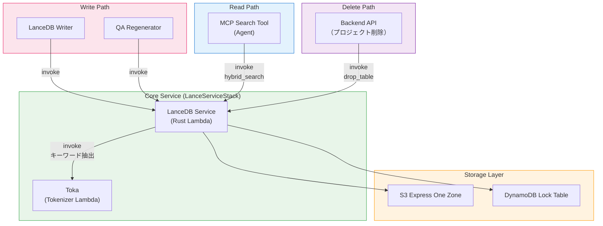

## 概要

このプロジェクトでは、Amazon OpenSearch Serviceの代わりに[LanceDB](https://lancedb.com/)をベクトルデータベースとして使用しています。LanceDBはオープンソースのサーバーレスベクトルデータベースで、データをS3に直接保存し、専用クラスターインフラが不要です。多言語トークナイザーLambdaの[Toka](https://github.com/aws-samples/sample-aws-idp-pipeline/tree/main/packages/lambda/toka)と組み合わせることで、すべてのサポート言語に対するハイブリッド検索（ベクトル＋全文検索）を実現しています。

### 多言語検索サポート

| 言語 | セマンティック検索（ベクトル） | 全文検索（FTS） | トークナイザー |
|------|:---:|:---:|------------|
| **韓国語** | O | O | Lindera (KoDic) |
| **日本語** | O | O | Lindera (IPADIC) |
| **中国語** | O | O | Lindera (Jieba) |
| **英語およびその他の言語** | O | O | ICU Word Segmenter |

Tokaは、CJK言語（韓国語、日本語、中国語）に対する言語別形態素解析と、その他の言語に対するICUベースの単語分割を提供する多言語トークナイザーです。これにより、すべての言語の文書でハイブリッド検索（ベクトル + FTS）が可能になります。

### PoCにLanceDBを選んだ理由

このプロジェクトは**PoC/プロトタイプ**であり、コスト効率が重要な要素です。

| 項目 | OpenSearch Service | LanceDB (S3) |
|------|-------------------|---------------|
| インフラ | 専用クラスター（最低2〜3ノード） | クラスター不要（サーバーレス） |
| アイドルコスト | 未使用時でも課金 | S3ストレージコストのみ |
| 設定の複雑さ | ドメイン構成、VPC、アクセスポリシー | S3バケット + DynamoDBロックテーブル |
| スケーリング | ノードスケーリングが必要 | S3と共に自動拡張 |
| 推定月額コスト（PoC） | $200〜500+（t3.medium x2最低） | $1〜10（S3 + DDBオンデマンド） |

:::note
OpenSearchはダッシュボード、k-NNプラグイン、きめ細かなアクセス制御など、本番ワークロードに適した豊富な機能を提供します。移行ガイドは[OpenSearchマイグレーション](#opensearchマイグレーション)を参照してください。
:::

---

## アーキテクチャ

```
書き込みパス:
  Analysis Finalizer → SQS (Write Queue) → LanceDB Writer Lambda
    → LanceDB Service Lambda (Rust)
        ├─ Toka Lambda: キーワード抽出（多言語）
        ├─ Bedrock Nova: ベクトル埋め込み (1024d)
        └─ LanceDB: S3 Express One Zoneに保存

読み取りパス:
  MCP Search Tool Lambda
    → LanceDB Service Lambda (Rust): ハイブリッド検索（ベクトル + FTS）
    → Bedrock Claude Haiku: 検索結果の要約

削除パス:
  Backend API（プロジェクト削除）
    → LanceDB Service Lambda: drop_table
```

### ストレージ構造

```
S3 Express One Zone (Directory Bucket)
  └─ idp-v2/
      ├─ {project_id_1}/     ← プロジェクトごとに1つのLanceDBテーブル
      │   ├─ data/
      │   └─ indices/
      └─ {project_id_2}/
          ├─ data/
          └─ indices/

DynamoDB (Lock Table)
  PK: base_uri  |  SK: version
  └─ LanceDBテーブルの同時アクセス管理
```

---

## コンポーネント

### 1. LanceDB Service Lambda（Rust）

ベクトルDBのコアサービスで、Rustとcargo-lambdaでビルドし、高いパフォーマンスと高速なコールドスタートを提供します。

| 項目 | 値 |
|------|-----|
| 関数名 | `idp-v2-lance-service` |
| ランタイム | Rust (provided.al2023, ARM64) |
| メモリ | 1024 MB |
| タイムアウト | 5分 |
| スタック | LanceServiceStack |
| ビルド | cargo-lambda（Dockerベース） |

**サポートアクション:**

| アクション | 説明 |
|-----------|------|
| `add_record` | QAレコード追加（Tokaでキーワード抽出 + Bedrockで埋め込み + 保存） |
| `delete_record` | QA IDまたはセグメントIDで削除 |
| `get_segments` | ワークフローの全セグメント取得 |
| `get_by_segment_ids` | セグメントIDリストで本文取得（Graph MCPで使用） |
| `hybrid_search` | ハイブリッド検索（ベクトル + FTS） |
| `list_tables` | 全プロジェクトテーブル一覧 |
| `count` | プロジェクトテーブルのレコード数取得 |
| `delete_by_workflow` | ワークフローIDで全レコード削除 |
| `drop_table` | プロジェクトテーブル全体を削除 |

### 2. Toka Lambda（多言語トークナイザー）

Rustベースの多言語トークナイザーLambdaで、言語別形態素解析によりテキストからキーワードを抽出します。

| 項目 | 値 |
|------|-----|
| 関数名 | `idp-v2-toka` |
| ランタイム | Rust (provided.al2023, ARM64) |
| メモリ | 1024 MB |
| スタック | LanceServiceStack |

**言語サポート:**

| 言語 | ライブラリ | 辞書 | 方式 |
|------|----------|------|------|
| 韓国語 | Lindera | KoDic | 形態素解析、ストップタグフィルタリング（助詞、語尾） |
| 日本語 | Lindera | IPADIC | 形態素解析、ストップタグフィルタリング（助詞、助動詞） |
| 中国語 | Lindera | Jieba | 単語分割、ストップワードフィルタリング（65個の一般単語） |
| その他 | ICU | - | Unicode単語境界分割 |

**インターフェース:**
- 入力: `{ text: string, lang: string }`
- 出力: `{ tokens: string[] }`

### 3. LanceDB Writer Lambda

分析パイプラインからの書き込みリクエストを受信し、LanceDB Serviceに委任するSQSコンシューマーです。

| 項目 | 値 |
|------|-----|
| 関数名 | `idp-v2-lancedb-writer` |
| ランタイム | Python 3.14 |
| メモリ | 256 MB |
| タイムアウト | 5分 |
| トリガー | SQS（`idp-v2-lancedb-write-queue`） |
| 同時実行数 | 1（順次処理） |

同時実行数を1に設定し、LanceDBテーブルへの同時書き込み競合を防止しています。

### 4. MCP Search Tool

AIチャット中にエージェントが文書を検索する際、LanceDB Service Lambdaを直接呼び出すMCPツールです。

```
ユーザークエリ → Bedrock Agent Core → MCP Gateway
  → Search Tool Lambda → LanceDB Service Lambda (hybrid_search)
    → Bedrock Claude Haiku: 検索結果の要約 → レスポンス
```

| 項目 | 値 |
|------|-----|
| スタック | McpStack |
| ランタイム | Node.js 22.x (ARM64) |
| タイムアウト | 30秒 |
| 環境変数 | `LANCEDB_FUNCTION_ARN`（SSM経由） |

---

## データスキーマ

各QA分析結果がレコードとして保存されます。1つのセグメント（ページ）に複数のQAが存在できるため、**QA単位でレコード**が作成されます:

```rust
DocumentRecord {
    workflow_id: String,            // ワークフローID
    document_id: String,            // 文書ID
    segment_id: String,             // "{workflow_id}_{segment_index:04d}"
    qa_id: String,                  // "{workflow_id}_{segment_index:04d}_{qa_index:02d}"
    segment_index: i64,             // セグメントページ/チャプター番号
    qa_index: i64,                  // QA番号（0から）
    question: String,               // AIが生成した質問
    content: String,                // content_combined（埋め込みソース）
    vector: FixedSizeList(f32, 1024), // Bedrock Nova埋め込み
    keywords: String,               // Toka抽出キーワード（FTSインデックス）
    file_uri: String,               // 元ファイルS3 URI
    file_type: String,              // MIMEタイプ
    image_uri: Option<String>,      // セグメント画像S3 URI
    created_at: Timestamp,          // タイムスタンプ
}
```

- **プロジェクトごとに1テーブル**: テーブル名 = `project_id`
- **QA単位保存**: セグメントごとに複数のQAが独立レコードとして保存（`qa_id`で一意識別）
- **`content`**: 全前処理結果を統合したテキスト（OCR + BDA + PDFテキスト + AI分析）
- **`vector`**: Bedrock Novaで生成（amazon.nova-2-multimodal-embeddings-v1:0、1024次元）
- **`keywords`**: Tokaで抽出したキーワード（FTSインデックス）、言語別トークン化

---

## Toka: 多言語トークナイザー

[Toka](https://github.com/aws-samples/sample-aws-idp-pipeline/tree/main/packages/lambda/toka)は、従来の韓国語専用Kiwiトークナイザーを置き換えるRustベースの多言語トークナイザーLambdaです。

### Tokaを使用する理由

LanceDBの内蔵FTSトークナイザーはCJK言語をうまく処理できません。CJK言語では正確なキーワード抽出のために言語別の形態素解析が必要です:

```
韓国語:   "인공지능 기반 문서 분석 시스템을 구축했습니다"
  Toka:   ["인공", "지능", "기반", "문서", "분석", "시스템", "구축"]

日本語:   "東京は日本の首都です"
  Toka:   ["東京", "日本", "首都"]

中国語:   "我喜欢学习中文"
  Toka:   ["喜欢", "学习", "中文"]

英語:     "Document analysis system"
  Toka:   ["Document", "analysis", "system"]
```

### CJKトークン化（Lindera）

韓国語、日本語、中国語の場合、Tokaは**Lindera**を使用して言語別辞書とストップタグ/ストップワードフィルターを適用します:

**韓国語（KoDic）:** 助詞（JK*）、語尾（EP/EF/EC）、冠形詞（MM）などをフィルタリングし、内容語のみを保持します。

**日本語（IPADIC）:** 助詞、助動詞、記号、フィラーをフィルタリングし、内容語のみを保持します。

**中国語（Jieba）:** 単語分割後、65個の一般的なストップワードをフィルタリングします。

### その他の言語（ICU）

CJK以外のすべての言語について、Tokaは**ICU Word Segmenter**を使用してUnicode標準の単語境界検出を行います。英数字を含まないセグメントはフィルタリングされます。

---

## ハイブリッド検索フロー

すべての検索はLanceDB Service Lambdaで処理されます。言語認識キーワード抽出により、ベクトル検索と全文検索を組み合わせます。

```
検索クエリ: "文書分析結果の照会"
  │
  ├─ [1] Tokaキーワード抽出（Toka Lambda経由）
  │     → "文書 分析 結果 照会"
  │
  ├─ [2] Bedrock Nova埋め込み生成
  │     → 1024次元ベクトル
  │
  ├─ [3] LanceDBハイブリッド検索
  │     → FTS: keywordsカラムでキーワードマッチング
  │     → Vector: vectorカラムで最近傍検索
  │     → 関連度スコアと共に結果を結合
  │
  └─ [4] 結果の要約（MCP Search Tool Lambda）
        → Bedrock Claude Haikuで検索結果に基づく回答を生成
```

---

## インフラ（CDK）

### LanceServiceStack

```typescript
// Toka Lambda（多言語トークナイザー）
const tokaFunction = new RustFunction(this, 'TokaFunction', {
  functionName: 'idp-v2-toka',
  manifestPath: '../lambda/toka',
  architecture: Architecture.ARM_64,
  memorySize: 1024,
});

// LanceDB Service Lambda (Rust)
const lanceDbServiceFunction = new RustFunction(this, 'LanceDbServiceFunction', {
  functionName: 'idp-v2-lance-service',
  manifestPath: '../lambda/lancedb-service',
  architecture: Architecture.ARM_64,
  memorySize: 1024,
  timeout: Duration.minutes(5),
  environment: {
    TOKA_FUNCTION_NAME: tokaFunction.functionName,
    LANCEDB_EXPRESS_BUCKET_NAME: '...',
    LANCEDB_LOCK_TABLE_NAME: '...',
  },
});
```

### S3 Express One Zone

```typescript
// StorageStack
const expressStorage = new CfnDirectoryBucket(this, 'LanceDbExpressStorage', {
  bucketName: `idp-v2-lancedb--use1-az4--x-s3`,
  dataRedundancy: 'SingleAvailabilityZone',
  locationName: 'use1-az4',
});
```

S3 Express One Zoneは一桁ミリ秒のレイテンシを提供し、ベクトル検索のような頻繁な読み書きパターンに最適化されています。

### DynamoDB Lock Table

```typescript
// StorageStack
const lockTable = new Table(this, 'LanceDbLockTable', {
  partitionKey: { name: 'base_uri', type: AttributeType.STRING },
  sortKey: { name: 'version', type: AttributeType.NUMBER },
  billingMode: BillingMode.PAY_PER_REQUEST,
});
```

複数のLambda関数が同じデータセットに同時アクセスする際の分散ロックを管理します。

### SSMパラメータ

| キー | 説明 |
|------|------|
| `/idp-v2/lancedb/lock/table-name` | DynamoDBロックテーブル名 |
| `/idp-v2/lancedb/express/bucket-name` | S3 Expressバケット名 |
| `/idp-v2/lancedb/express/az-id` | S3 Express可用性ゾーンID |
| `/idp-v2/lance-service/function-arn` | LanceDB Service Lambda関数ARN |
| `/idp-v2/toka/function-name` | TokaトークナイザーLambda関数名 |

---

## コンポーネント依存関係マップ

LanceDBに依存するすべてのコンポーネントを示したダイアグラムです:



| コンポーネント | スタック | アクセスタイプ | 説明 |
|--------------|--------|-------------|------|
| **LanceDB Service** | LanceServiceStack | 読み書き | コアDBサービス（Rust Lambda） |
| **Toka** | LanceServiceStack | 読み取り | 多言語トークナイザー（Rust Lambda） |
| **LanceDB Writer** | WorkflowStack | 書き込み（Service経由） | SQSコンシューマー、Serviceに委任 |
| **Analysis Finalizer** | WorkflowStack | 書き込み（SQS/Service経由） | セグメントを書き込みキューに送信、再分析時に削除 |
| **QA Regenerator** | WorkflowStack | 書き込み（Service経由） | Q&Aセグメント更新 |
| **MCP Search Tool** | McpStack | 読み取り（Service直接呼び出し） | エージェント文書検索ツール |
| **Backend API** | ApplicationStack | 削除（Service経由） | プロジェクト削除時に`drop_table`を呼び出し |

---

## OpenSearchマイグレーション

本番環境でAmazon OpenSearch Serviceに移行する場合、以下のコンポーネントの修正が必要です。

### 交換対象コンポーネント

| コンポーネント | 現在（LanceDB） | 変更後（OpenSearch） | 範囲 |
|--------------|----------------|---------------------|------|
| **LanceDB Service Lambda** | Rust Lambda + LanceDB | OpenSearchクライアント（CRUD + 検索） | 全面交換 |
| **Toka Lambda** | Rustトークナイザー Lambda | 不要（Noriが韓国語を処理） | 削除 |
| **LanceDB Writer Lambda** | SQS → LanceDB Service呼び出し | SQS → OpenSearchインデックス書き込み | 呼び出し先交換 |
| **MCP Search Tool** | Lambda invoke → LanceDB Service | Lambda invoke → OpenSearch検索 | 呼び出し先交換 |
| **StorageStack** | S3 Express + DDBロックテーブル | OpenSearchドメイン（VPC） | リソース交換 |

### 変更不要コンポーネント

| コンポーネント | 理由 |
|--------------|------|
| **Analysis Finalizer** | SQSにメッセージ送信のみ（キューインターフェース不変） |
| **Frontend** | DB直接アクセスなし |
| **Step Functions Workflow** | LanceDB直接依存なし |

### マイグレーション戦略

```
Phase 1: ストレージ層の交換
  - VPC内にOpenSearchドメインを作成
  - StorageStackリソース交換（S3 Express + DDBロック削除）
  - 韓国語トークン化のためのNori分析器設定

Phase 2: 書き込みパスの交換
  - LanceDB Service → OpenSearchインデクシングサービスに変更
  - 文書スキーマ変更（OpenSearchインデックスマッピング）
  - 埋め込み用OpenSearch neural ingest pipeline追加

Phase 3: 読み取りパスの交換
  - MCP Search Tool LambdaのinvokeターゲットをOpenSearch検索サービスに変更
  - Toka依存関係削除（NoriがCJKトークン化を処理）

Phase 4: LanceDB依存関係の削除
  - LanceServiceStack削除（Rust Lambda群）
  - S3 ExpressバケットおよびDDBロックテーブルの削除
```

### 主要考慮事項

| 項目 | 内容 |
|------|------|
| CJKトークン化 | OpenSearchには[Nori分析器](https://opensearch.org/docs/latest/analyzers/language-analyzers/#korean-nori)が内蔵されておりCJKサポートも標準提供、Toka削除可能 |
| ベクトル検索 | OpenSearch k-NNプラグイン（HNSW/IVF）がLanceDBベクトル検索を代替 |
| 埋め込み | OpenSearch neural searchでingest pipelineから自動埋め込み可能、または事前計算済み埋め込みを使用 |
| コスト | OpenSearchは稼働中のクラスターが必要。HAのための最低2ノードクラスター |
| SQSインターフェース | SQS書き込みキューパターンは維持可能、コンシューマーロジックのみ変更 |
