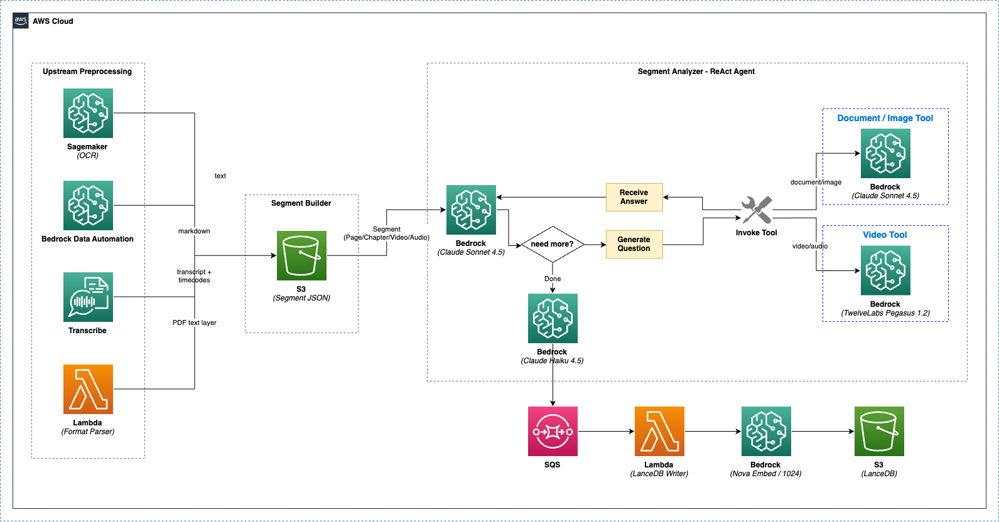

## 개요

Segment Analyzer는 Strands SDK 기반의 **ReAct(Reasoning + Acting) 에이전트**로, 업스트림 전처리 결과(OCR, BDA, PDF 텍스트, Transcribe)와 AI 도구를 결합하여 문서와 영상을 반복적으로 분석합니다. 에이전트가 스스로 질문을 생성하고, 도구를 호출하여 답변을 얻고, 종합하는 과정을 반복하며 깊이 있는 분석을 수행합니다.

---

## 분석 흐름 전체 구조



```
업스트림 전처리 (병렬)
  ├─ PaddleOCR (SageMaker)     ── 텍스트 추출 (자동)
  ├─ Bedrock Data Automation   ── 문서 구조 분석 (옵션)
  ├─ Format Parser             ── PDF 텍스트 레이어 추출 (자동, PDF만)
  └─ AWS Transcribe            ── 음성/영상 텍스트 변환 (자동)
       ↓
  Segment Builder (모든 결과 병합 → S3 세그먼트 JSON)
       ↓
  Segment Analyzer (ReAct Agent)
  ├─ 문서/이미지 → Claude Sonnet 4.5 + 이미지 분석 도구
  └─ 영상/음성   → Claude Sonnet 4.5 + Pegasus 영상 분석 도구
       ↓
  Analysis Finalizer → SQS → LanceDB Writer
       ↓
  Document Summarizer (Claude Haiku 4.5)
```

---

## 업스트림 전처리

Segment Analyzer가 분석을 시작하기 전에, 여러 전처리기가 원본 파일에서 정보를 추출합니다.

### PaddleOCR

문서와 이미지에서 텍스트를 추출합니다. 자세한 내용은 [PaddleOCR on SageMaker](./ocr)를 참조하세요.

### Bedrock Data Automation (옵션)

AWS BDA를 사용하여 문서 구조(테이블, 레이아웃 등)를 마크다운 형태로 분석합니다. 프로젝트 설정에서 활성화/비활성화할 수 있습니다.

### AWS Transcribe

오디오/비디오 파일에서 음성을 텍스트로 변환합니다. 타임코드가 포함된 세그먼트 단위 트랜스크립트를 생성합니다.

### Format Parser

| 항목       | 값                                              |
| ---------- | ----------------------------------------------- |
| 대상       | PDF 파일만 (`application/pdf`)                  |
| 라이브러리 | `pypdf`                                         |
| 동작       | 페이지별 텍스트 레이어 추출                     |
| 목적       | 디지털 PDF의 경우 OCR 없이도 정확한 텍스트 확보 |

디지털 PDF에는 텍스트 레이어가 포함되어 있어, OCR보다 정확한 원본 텍스트를 추출할 수 있습니다. 이 결과는 OCR/BDA 결과와 함께 Segment Analyzer의 컨텍스트로 제공됩니다.

---

## Segment Builder

모든 전처리 결과를 **단일 세그먼트 JSON**으로 병합하는 단계입니다.

### 문서/이미지 세그먼트

```json
{
  "segment_index": 0,
  "segment_type": "PAGE",
  "image_uri": "s3://.../preprocessed/page_0000.png",
  "paddleocr": "OCR로 추출한 텍스트...",
  "bda_indexer": "BDA 마크다운 결과...",
  "format_parser": "PDF 텍스트 레이어...",
  "ai_analysis": []
}
```

### 영상/음성 세그먼트

```json
{
  "segment_index": 0,
  "segment_type": "CHAPTER",
  "file_uri": "s3://.../video.mp4",
  "start_timecode_smpte": "00:00:00:00",
  "end_timecode_smpte": "00:05:30:00",
  "transcribe": "전체 트랜스크립트...",
  "transcribe_segments": [
    {"id": 0, "transcript": "...", "start_time": "0.0", "end_time": "5.2"}
  ],
  "bda_indexer": "챕터 요약...",
  "ai_analysis": []
}
```

---

## Segment Analyzer (ReAct Agent)

### 동작 방식

Segment Analyzer는 **반복적 질문-응답** 방식으로 분석합니다. 에이전트가 컨텍스트(OCR, BDA, PDF 텍스트 등)를 확인한 후, 스스로 질문을 만들어 도구를 호출하고, 응답을 받아 종합합니다. 이 과정을 여러 번 반복하여 깊이 있는 분석을 수행합니다.

```
에이전트가 컨텍스트 확인
  → "이 문서가 어떤 유형인지 확인해야겠다"
    → analyze_image("이 문서의 유형과 구조는?") 호출
      → Claude Sonnet 4.5이 이미지를 보고 응답
  → "테이블이 있으니 자세히 분석해야겠다"
    → analyze_image("테이블의 구조와 데이터를 추출해줘") 호출
      → Claude Sonnet 4.5이 응답
  → "기술 도면의 치수를 확인해야겠다"
    → analyze_image("도면에 표시된 치수와 사양은?") 호출
      → Claude Sonnet 4.5이 응답
  → 모든 결과 종합하여 최종 분석 작성
```

### 적응형 분석 깊이

에이전트는 콘텐츠 복잡도에 따라 분석 깊이를 자동 조절합니다.

| 복잡도 | 도구 호출 횟수 | 예시 |
|--------|---------------|------|
| 최소 | 1회 | 빈 페이지, 단순 텍스트 |
| 보통 | 2~3회 | 일반 문서 페이지 |
| 심층 | 4회 이상 | 기술 도면, 복잡한 테이블, 다이어그램 |

---

## 문서/이미지 분석

### 사용 모델

| 모델 | 용도 |
|------|------|
| **Claude Sonnet 4.5** | ReAct 에이전트 (추론 + 도구 호출 결정) |
| **Claude Sonnet 4.5** (Vision) | 이미지 분석 도구 (도구 내부에서 이미지와 질문 처리) |

### 사용 도구

#### analyze_image

문서 이미지에 대해 특정 질문을 던져 분석합니다. Claude Sonnet 4.5의 Vision 기능을 사용하여 이미지를 직접 확인하고 답변합니다.

```python
@tool
def analyze_image(question: str) -> str:
    """문서 이미지를 특정 질문으로 분석합니다.

    텍스트 내용, 시각적 요소, 다이어그램, 테이블 등에 대해
    타겟 질문을 던져 분석합니다.
    """
```

**질문 예시:**
- "이 문서의 유형과 전체 구조를 설명해줘"
- "테이블에 포함된 모든 데이터를 추출해줘"
- "기술 도면에 표시된 치수와 사양을 읽어줘"
- "차트의 데이터 포인트와 트렌드를 분석해줘"

#### rotate_image

문서 이미지가 회전되어 있을 때 보정합니다.

```python
@tool
def rotate_image(degrees: int) -> str:
    """현재 문서 이미지를 지정된 각도로 회전합니다.

    텍스트가 거꾸로, 옆으로, 또는 비스듬히 나타날 때 사용합니다.
    """
```

### 분석 프로세스

```
입력: 이미지 + OCR 텍스트 + BDA 결과(옵션) + PDF 텍스트(PDF만)
  ↓
[1단계] 방향 확인 → 필요시 rotate_image로 보정
  ↓
[2단계] 문서 개요 → analyze_image("이 문서의 유형은?")
  ↓
[3단계] 텍스트 추출 → analyze_image("모든 텍스트를 추출해줘")
  ↓
[4단계] 테이블/도표 → analyze_image("테이블과 차트를 분석해줘")
  ↓
[5단계] 세부 사항 → analyze_image("기술 사양과 치수를 추출해줘")
  ↓
최종 종합 → 모든 도구 응답을 통합하여 구조화된 분석 작성
```

---

## 영상/음성 분석

### 사용 모델

| 모델 | 용도 |
|------|------|
| **Claude Sonnet 4.5** | ReAct 에이전트 (추론 + 도구 호출 결정) |
| **TwelveLabs Pegasus 1.2** | 영상 분석 도구 (도구 내부에서 영상 직접 분석) |

### 사용 도구

#### analyze_video

영상 세그먼트에 대해 특정 질문을 던져 분석합니다. TwelveLabs Pegasus 1.2 모델이 S3의 영상을 직접 시청하고 분석합니다.

```python
@tool
def analyze_video(question: str) -> str:
    """영상 세그먼트를 특정 질문으로 분석합니다.

    시각적 콘텐츠, 동작, 장면, 객체, 인물, 텍스트 오버레이 등에 대해
    타겟 질문을 던져 분석합니다.
    """
```

**질문 예시:**
- "이 영상에서 어떤 동작이 수행되고 있나?"
- "화면에 나타나는 주요 객체와 인물을 설명해줘"
- "화면에 표시되는 텍스트를 읽어줘"
- "이 세그먼트의 핵심 이벤트는 무엇인가?"

### Pegasus 모델 호출

```python
{
    "inputPrompt": "이 영상 세그먼트에서 어떤 동작이 수행되고 있나?",
    "mediaSource": {
        "s3Location": {
            "uri": "s3://bucket/projects/p1/documents/d1/video.mp4",
            "bucketOwner": "123456789012"
        }
    }
}
```

Pegasus는 S3의 영상 파일을 직접 분석하며, BDA가 추출한 챕터 정보(타임코드)를 기반으로 세그먼트가 분할됩니다.

### 분석 프로세스

```
입력: 영상 URI + Transcribe 결과 + BDA 챕터 요약(옵션) + 타임코드
  ↓
[1단계] 콘텐츠 개요 → analyze_video("주요 콘텐츠를 설명해줘")
  ↓
[2단계] 시각적 요소 → analyze_video("어떤 동작과 객체가 보이나?")
  ↓
[3단계] 음성 내용 → analyze_video("발화 내용을 요약해줘")
  ↓
[4단계] 핵심 이벤트 → analyze_video("핵심 이벤트는 무엇인가?")
  ↓
최종 종합 → Transcribe + Pegasus 응답을 통합하여 타임라인 기반 분석 작성
```

---

## 문서 vs 영상 비교

| 항목 | 문서/이미지 | 영상/음성 |
|------|------------|----------|
| 세그먼트 유형 | `PAGE` | `CHAPTER`, `VIDEO`, `AUDIO` |
| 입력 데이터 | 이미지 URI | 영상 URI + 타임코드 |
| 전처리 데이터 | OCR + BDA(옵션) + PDF 텍스트 | Transcribe + BDA(옵션) |
| 에이전트 모델 | Claude Sonnet 4.5 | Claude Sonnet 4.5 |
| 분석 도구 모델 | Claude Sonnet 4.5 (Vision) | TwelveLabs Pegasus 1.2 |
| 도구 | `analyze_image`, `rotate_image` | `analyze_video` |
| 분석 초점 | 텍스트, 테이블, 다이어그램, 레이아웃 | 동작, 장면, 음성, 시각적 이벤트 |

---

## Document Summarizer

모든 세그먼트 분석이 완료된 후, Document Summarizer가 전체 문서 요약을 생성합니다.

| 항목 | 값 |
|------|-----|
| 모델 | Claude Haiku 4.5 (`claude-4-5-haiku`) |
| 입력 | 모든 세그먼트의 AI 분석 결과 (최대 50,000자) |
| 출력 | 구조화된 문서 요약 |

```
요약 구조:
  1. 문서 개요 (1~2문장)
  2. 주요 발견 사항 (3~5개 항목)
  3. 중요 데이터 포인트
  4. 결론
```

> Claude Haiku를 사용하는 이유: 심층 분석은 Segment Analyzer에서 이미 완료되었으므로, 요약 단계에서는 빠르고 비용 효율적인 모델로 충분합니다.

---

## 분석 결과 저장

각 도구 호출의 결과는 `ai_analysis` 배열에 순차적으로 저장됩니다.

```json
{
  "ai_analysis": [
    {
      "analysis_query": "이 문서의 유형과 구조는?",
      "content": "이 문서는 기술 사양서로..."
    },
    {
      "analysis_query": "테이블의 데이터를 추출해줘",
      "content": "테이블에는 다음 항목이 포함되어 있습니다..."
    }
  ]
}
```

분석 완료 후 Analysis Finalizer가 `content_combined`(모든 분석 결과 통합)를 생성하여 SQS를 통해 LanceDB Writer로 전달합니다. LanceDB Writer는 Nova Embed로 벡터 임베딩을 수행하고 LanceDB에 저장합니다.

---

## 다국어 지원

Segment Analyzer는 프로젝트 설정 언어에 따라 분석 결과를 해당 언어로 생성합니다. 한국어, 영어, 일본어, 중국어를 지원합니다.

---

## 재분석

이미 분석된 세그먼트를 커스텀 지시사항으로 재분석할 수 있습니다. 재분석 시 프로젝트 기본 프롬프트 대신 사용자 지정 지시사항이 적용됩니다.

---

## 라이선스

이 프로젝트는 [Amazon Software License](../../LICENSE)에 따라 라이선스가 부여됩니다.
