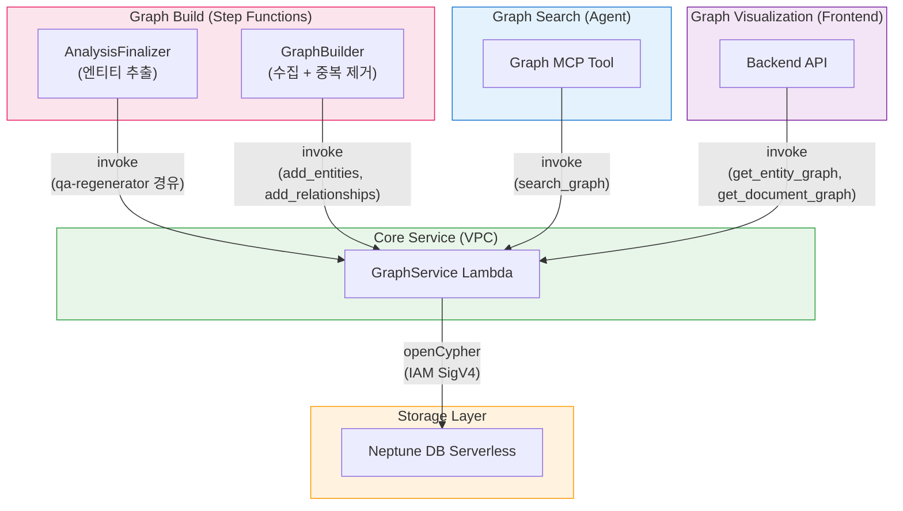

## 개요

이 프로젝트는 [Amazon Neptune DB Serverless](https://docs.aws.amazon.com/neptune/latest/userguide/neptune-serverless.html)를 그래프 데이터베이스로 사용합니다. 문서 분석 과정에서 추출된 엔티티(인물, 조직, 개념, 기술 등)와 관계를 지식 그래프로 구축하여, 벡터 검색만으로는 찾기 어려운 **엔티티 간 연결 관계 기반 탐색**을 지원합니다.

### 벡터 검색과의 차이점

| 항목 | 벡터 검색 (LanceDB) | 그래프 탐색 (Neptune) |
|------|---------------------|----------------------|
| 검색 방식 | 의미적 유사도 기반 | 엔티티 관계 그래프 순회 |
| 강점 | "비슷한 내용" 검색 | "연결된 내용" 탐색 |
| 예시 | "AI 분석"으로 검색 → 유사한 내용의 세그먼트 | "AWS Bedrock"이 언급된 페이지에서 → 관련 엔티티가 등장하는 다른 페이지 발견 |
| 데이터 | content_combined + 벡터 임베딩 | 엔티티, 관계, 세그먼트 노드 |

이 두 검색 방식은 **MCP Search Tool + MCP Graph Tool**을 통해 에이전트가 함께 사용합니다. 벡터 검색으로 초기 결과를 얻고, 그래프 탐색으로 연관 페이지를 추가 발견하는 방식입니다.

---

## 아키텍처

### 그래프 구축 (쓰기 경로)

```
Step Functions Workflow
  → Map(SegmentAnalyzer + AnalysisFinalizer)
    → AnalysisFinalizer: Strands Agent로 엔티티/관계 추출 (세그먼트별 병렬)
      → GraphBuilder Lambda: 수집 + 중복 제거
        → GraphService Lambda (VPC): openCypher 쿼리 실행
          → Neptune DB Serverless
```

### 그래프 검색 (읽기 경로)

```
Agent → MCP Gateway → Graph MCP Lambda
  → GraphService Lambda (VPC): graph_search (엔티티 탐색)
  → LanceDB Service Lambda: 세그먼트 본문 조회
  → Bedrock Claude Haiku: 결과 요약
```

### 그래프 시각화 (Backend API)

```
Frontend → Backend API → GraphService Lambda (VPC)
  → get_entity_graph: 프로젝트 전체 엔티티 그래프
  → get_document_graph: 문서별 상세 그래프
```

---

## 그래프 스키마

Neptune에 저장되는 노드와 관계 구조입니다. 쿼리 언어로 openCypher를 사용합니다.

### 노드 (Labels)

| 노드 | 설명 | 주요 속성 |
|------|------|-----------|
| **Document** | 문서 | `id`, `project_id`, `workflow_id`, `file_name`, `file_type` |
| **Segment** | 문서 페이지/섹션 | `id`, `project_id`, `workflow_id`, `document_id`, `segment_index` |
| **Analysis** | QA 분석 결과 | `id`, `project_id`, `workflow_id`, `document_id`, `segment_index`, `qa_index`, `question` |
| **Entity** | 추출된 엔티티 | `id`, `project_id`, `name`, `type` |

### 관계 (Edges)

| 관계 | 방향 | 설명 |
|------|------|------|
| `BELONGS_TO` | Segment → Document | 세그먼트가 문서에 소속 |
| `BELONGS_TO` | Analysis → Segment | 분석이 세그먼트에 소속 |
| `NEXT` | Segment → Segment | 페이지 순서 (다음 세그먼트) |
| `MENTIONED_IN` | Entity → Analysis | 엔티티가 특정 QA에서 언급됨 (`confidence`, `context`) |
| `RELATES_TO` | Entity → Entity | 엔티티 간 관계 (`relationship`, `source`) |
| `RELATED_TO` | Document → Document | 문서 간 수동 연결 (`reason`, `label`) |

### 노드 ID 설계

Neptune은 별도의 인덱스를 지원하지 않으며, 노드의 `~id` 속성만이 유일한 O(1) 직접 조회 수단입니다. 따라서 각 노드 타입의 ID를 의미 있는 복합 키로 구성하여, 인덱스 없이도 빠른 조회가 가능하도록 설계했습니다.

| 노드 | ID 형식 | 예시 |
|------|---------|------|
| **Document** | `{document_id}` | `doc_abc123` |
| **Segment** | `{workflow_id}_{segment_index:04d}` | `wf_abc123_0042` |
| **Analysis** | `{workflow_id}_{segment_index:04d}_{qa_index:02d}` | `wf_abc123_0042_00` |
| **Entity** | SHA256(`{project_id}:{name}:{type}`)의 앞 16자 | `a1b2c3d4e5f6g7h8` |

- **Segment/Analysis**: 워크플로우 ID + 세그먼트 인덱스(+ QA 인덱스)를 조합하여, ID만으로 소속 관계를 파악할 수 있습니다
- **Entity**: 프로젝트 ID + 정규화된 이름 + 타입의 해시를 사용하여, 동일한 엔티티가 여러 세그먼트에서 추출되더라도 자연스럽게 같은 노드로 병합(MERGE)됩니다

### 그래프 구조 예시

```
Document (report.pdf)
  ├── Segment (page 0) ──NEXT──→ Segment (page 1) ──NEXT──→ ...
  │     └── Analysis (QA 1) ←──MENTIONED_IN── Entity ("AWS Bedrock", TECH)
  │     └── Analysis (QA 2) ←──MENTIONED_IN── Entity ("Claude", PRODUCT)
  │                                                  │
  │                                           RELATES_TO
  │                                                  ▼
  │                                            Entity ("Anthropic", ORG)
  └── Segment (page 1)
        └── Analysis (QA 1) ←──MENTIONED_IN── Entity ("Anthropic", ORG)
```

---

## 구성 요소

### 1. Neptune DB Serverless

| 항목 | 값 |
|------|-----|
| 클러스터 ID | `idp-v2-neptune` |
| 엔진 버전 | 1.4.1.0 |
| 인스턴스 클래스 | `db.serverless` |
| 용량 | min: 1 NCU, max: 2.5 NCU |
| 서브넷 | Private Isolated |
| 인증 | IAM Auth (SigV4) |
| 포트 | 8182 |
| 쿼리 언어 | openCypher |

Neptune DB Serverless는 사용량에 따라 자동으로 스케일링되며, 유휴 시 최소 용량(1 NCU)으로 비용을 절감합니다.

### 2. GraphService Lambda

Neptune과 직접 통신하는 게이트웨이 Lambda입니다. VPC 내부(Private Isolated Subnet)에 배치되어 Neptune 엔드포인트에 접근합니다.

| 항목 | 값 |
|------|-----|
| 함수 이름 | `idp-v2-graph-service` |
| 런타임 | Python 3.14 |
| 타임아웃 | 5분 |
| VPC | Private Isolated Subnet |
| 인증 | IAM SigV4 (neptune-db) |

**지원 액션:**

| 카테고리 | 액션 | 설명 |
|----------|------|------|
| **쓰기** | `add_segment_links` | Document + Segment 노드 생성, BELONGS_TO/NEXT 관계 구축 |
| | `add_analyses` | Analysis 노드 생성, Segment에 BELONGS_TO 연결 |
| | `add_entities` | Entity 노드 MERGE, Analysis에 MENTIONED_IN 연결 |
| | `add_relationships` | Entity 간 RELATES_TO 관계 생성 |
| | `link_documents` | 문서 간 양방향 RELATED_TO 관계 생성 |
| | `unlink_documents` | 문서 간 RELATED_TO 관계 삭제 |
| | `delete_analysis` | Analysis 노드 삭제 + 고아 Entity 정리 |
| | `delete_by_workflow` | 워크플로우 전체 그래프 데이터 삭제 |
| **읽기** | `search_graph` | QA ID 기반 그래프 탐색 (Entity → RELATES_TO → 관련 Segment) |
| | `traverse` | N-hop 그래프 순회 |
| | `find_related_segments` | 엔티티 ID로 관련 세그먼트 탐색 |
| | `get_entity_graph` | 프로젝트 전체 엔티티 그래프 조회 (시각화) |
| | `get_document_graph` | 문서별 상세 그래프 조회 (시각화) |
| | `get_linked_documents` | 문서 간 연결 관계 조회 |

### 3. GraphBuilder Lambda (Step Functions)

Step Functions 워크플로우에서 Map(SegmentAnalyzer) 완료 후, DocumentSummarizer 전에 실행됩니다.

| 항목 | 값 |
|------|-----|
| 함수 이름 | `idp-v2-graph-builder` |
| 런타임 | Python 3.14 |
| 타임아웃 | 15분 |
| 스택 위치 | WorkflowStack |

**처리 흐름:**

1. **Document + Segment 구조 생성** — Neptune에 문서/세그먼트 노드와 BELONGS_TO, NEXT 관계 생성
2. **S3에서 세그먼트 분석 결과 로드** — 전체 세그먼트의 분석 데이터 수집
3. **Analysis 노드 생성** — 각 QA 쌍별로 Analysis 노드를 배치 생성 (200개 단위)
4. **Entity/Relationship 수집** — AnalysisFinalizer에서 세그먼트별로 이미 추출된 엔티티와 관계를 수집
5. **Entity 중복 제거** — 이름 + 타입 기준으로 동일 엔티티 통합
6. **Neptune에 배치 저장** — Entity와 Relationship를 50개 단위, 최대 10 workers로 병렬 저장

### 4. Graph MCP Tool

AI 에이전트가 그래프 탐색을 수행할 때 사용하는 MCP 도구입니다.

| 항목 | 값 |
|------|-----|
| 스택 | McpStack |
| 런타임 | Node.js 22.x (ARM64) |
| 타임아웃 | 30초 |

**도구:**

| MCP 도구 | 설명 |
|----------|------|
| `graph_search` | 벡터 검색 QA ID를 시작점으로 그래프를 순회하여 관련 페이지 탐색 |
| `link_documents` | 문서 간 수동 연결 생성 (사유 포함) |
| `unlink_documents` | 문서 간 연결 삭제 |
| `get_linked_documents` | 문서 연결 관계 조회 |

**graph_search 동작 방식:**

```
1. 벡터 검색 결과의 QA ID를 시작점으로 사용
2. QA ID → Analysis 노드 → MENTIONED_IN ← Entity 노드 탐색
3. Entity → RELATES_TO → 관련 Entity → MENTIONED_IN → 다른 Analysis 탐색
4. 발견된 세그먼트의 본문을 LanceDB에서 조회
5. Bedrock Claude Haiku로 결과 요약
```

---

## 엔티티 추출

### 추출 시점

엔티티 추출은 **AnalysisFinalizer** Lambda에서 세그먼트별로 병렬 실행됩니다. Step Functions의 Distributed Map 안에서 수행되므로 최대 30개 세그먼트가 동시에 엔티티를 추출합니다.

### 추출 방식

Strands Agent를 사용하여 LLM 기반으로 엔티티와 관계를 추출합니다.

| 항목 | 값 |
|------|-----|
| 모델 | Bedrock (구성 가능) |
| 프레임워크 | Strands SDK (Agent) |
| 입력 | 세그먼트의 AI 분석 결과 + 페이지 설명 |
| 출력 | `entities[]` + `relationships[]` (JSON) |

### 추출 규칙

- 엔티티 이름은 정규화된 형태 사용 (예: "the transformer model" → "Transformer")
- 일반적 참조는 제외 (예: "Figure 1", "Table 2", "the author")
- 엔티티 타입은 영문 대문자 (예: PERSON, ORG, CONCEPT, TECH, PRODUCT)
- 엔티티 이름, 컨텍스트, 관계 레이블은 문서 언어로 작성
- 각 QA 쌍에 최소 하나의 엔티티가 연결되도록 보장

### 추출 결과 예시

```json
{
  "entities": [
    {
      "name": "Amazon Bedrock",
      "type": "TECH",
      "mentioned_in": [
        {
          "segment_index": 0,
          "qa_index": 0,
          "confidence": 0.95,
          "context": "AI 모델 호스팅 플랫폼으로 사용"
        }
      ]
    }
  ],
  "relationships": [
    {
      "source": "Amazon Bedrock",
      "source_type": "TECH",
      "target": "Claude",
      "target_type": "PRODUCT",
      "relationship": "호스팅"
    }
  ]
}
```

---

## 인프라 (CDK)

### NeptuneStack

```typescript
// Neptune DB Serverless Cluster
const cluster = new neptune.CfnDBCluster(this, 'NeptuneCluster', {
  dbClusterIdentifier: 'idp-v2-neptune',
  engineVersion: '1.4.1.0',
  iamAuthEnabled: true,
  serverlessScalingConfiguration: {
    minCapacity: 1,
    maxCapacity: 2.5,
  },
});

// Serverless Instance
const instance = new neptune.CfnDBInstance(this, 'NeptuneInstance', {
  dbInstanceClass: 'db.serverless',
  dbClusterIdentifier: cluster.dbClusterIdentifier!,
});
```

### 네트워크 구성

```
VPC (10.0.0.0/16)
  └─ Private Isolated Subnet
      ├─ Neptune DB Serverless (port 8182)
      └─ GraphService Lambda (SG: VPC CIDR → 8182 허용)
```

GraphService Lambda만 VPC에 배치되며, GraphBuilder Lambda와 Graph MCP Lambda는 VPC 외부에서 GraphService를 Lambda invoke로 호출합니다.

### SSM 파라미터

| 키 | 설명 |
|----|------|
| `/idp-v2/neptune/cluster-endpoint` | Neptune 클러스터 엔드포인트 |
| `/idp-v2/neptune/cluster-port` | Neptune 클러스터 포트 |
| `/idp-v2/neptune/cluster-resource-id` | Neptune 클러스터 리소스 ID |
| `/idp-v2/neptune/security-group-id` | Neptune 보안 그룹 ID |
| `/idp-v2/graph-service/function-arn` | GraphService Lambda 함수 ARN |

---

## 컴포넌트 의존성 맵



| 컴포넌트 | 스택 | 접근 유형 | 설명 |
|----------|------|-----------|------|
| **GraphService** | WorkflowStack | 읽기/쓰기 | 핵심 Neptune 게이트웨이 (VPC 내부) |
| **GraphBuilder** | WorkflowStack | 쓰기 (GraphService 경유) | Step Functions에서 그래프 구축 |
| **AnalysisFinalizer** | WorkflowStack | 쓰기 (GraphService 경유) | 세그먼트별 엔티티 추출 + QA 재생성 시 그래프 업데이트 |
| **Graph MCP Tool** | McpStack | 읽기 (GraphService 경유) | 에이전트 그래프 탐색 도구 |
| **Backend API** | ApplicationStack | 읽기 (GraphService 경유) | 프론트엔드 그래프 시각화 |
