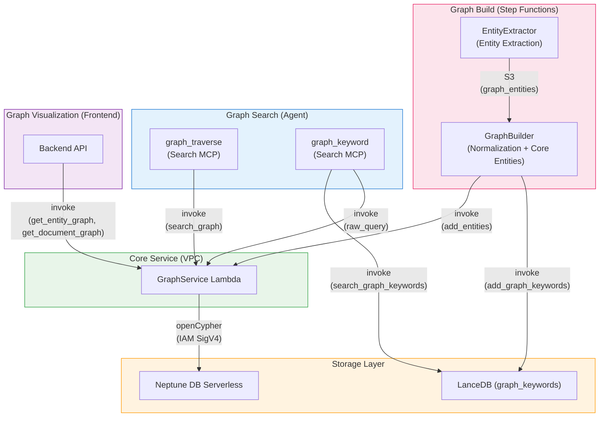

## 개요

이 프로젝트는 [Amazon Neptune DB Serverless](https://docs.aws.amazon.com/neptune/latest/userguide/neptune-serverless.html)를 그래프 데이터베이스로 사용합니다. 문서 분석 과정에서 추출 및 정규화된 핵심 엔티티를 지식 그래프에 저장하여, 벡터 검색만으로는 달성하기 어려운 **엔티티 연결 기반 탐색**을 지원합니다.

### 벡터 검색과의 차이점

| 관점 | 벡터 검색 (LanceDB) | 그래프 탐색 (Neptune) | 키워드 그래프 (LanceDB + Neptune) |
|------|----------------------|----------------------|----------------------------------|
| 검색 방식 | 의미적 유사도 | 엔티티 관계 탐색 | 키워드 임베딩 유사도 + 그래프 탐색 |
| 강점 | "유사한 콘텐츠" 찾기 | 검색 결과에서 "연결된 콘텐츠" 발견 | 개념 키워드로 페이지 발견 |
| 입력 | 사용자 질의 | 검색 결과의 QA ID | 키워드 문자열 |
| 데이터 | content_combined + 벡터 임베딩 | 핵심 엔티티 노드 + MENTIONED_IN 엣지 | 그래프 키워드 (이름 + 임베딩) + Neptune 엔티티 |

이러한 검색 방식들은 에이전트가 **Search MCP 도구**를 통해 함께 사용합니다:
- `search___summarize` — 문서 하이브리드 검색
- `search___graph_traverse` — 검색 결과 QA ID 기반 그래프 탐색
- `search___graph_keyword` — LanceDB 그래프 키워드를 통한 키워드 유사도 검색

---

## 아키텍처

### 그래프 구축 (쓰기 경로)

```
Step Functions Workflow
  → Distributed Map (max 30 concurrency)
    → SegmentAnalyzer
    → Parallel:
      +- AnalysisFinalizer (SQS → LanceDB)
      +- PageDescriptionGenerator (Haiku)
      '- EntityExtractor (Haiku) → S3 (graph_entities)
  → GraphBuilder Lambda:
    1. Collect entities from all segments (S3)
    2. Deduplicate (exact name match)
    3. Normalize → Core entities (Sonnet via Strands structured output)
    4. Store core entity names in LanceDB (add_graph_keywords)
    5. Save work files to S3 (entities.json, analyses.json)
  → GraphBatchSender (Map) → GraphService Lambda (VPC) → Neptune
```

### 그래프 탐색 (읽기 경로 — 검색 결과 기반)

```
Agent → MCP Gateway → Search MCP Lambda (graph_traverse)
  → GraphService Lambda (VPC): search_graph (entity traversal from qa_ids)
  → LanceDB Service Lambda: Segment content retrieval
  → Bedrock Claude Haiku: Result summarization
```

### 키워드 그래프 검색 (읽기 경로 — 키워드 기반)

```
Agent → MCP Gateway → Search MCP Lambda (graph_keyword)
  → LanceDB Service: search_graph_keywords (embedding similarity)
  → SHA256 hash entity names → Neptune entity ~id
  → GraphService Lambda (VPC): raw_query (find connected qa_ids)
  → LanceDB Service: get_by_qa_ids (content retrieval)
  → Bedrock Claude Haiku: Result summarization
```

### 그래프 시각화 (Backend API)

```
Frontend → Backend API → GraphService Lambda (VPC)
  → get_entity_graph: Project-wide entity graph
  → get_document_graph: Document-level detailed graph
```

---

## 그래프 스키마

Neptune에 저장되는 노드 및 관계 구조입니다. 쿼리 언어로 openCypher를 사용합니다.

### 노드 (Labels)

| 노드 | 설명 | 주요 속성 |
|------|------|----------|
| **Document** | 문서 | `id`, `project_id`, `workflow_id`, `file_name`, `file_type` |
| **Segment** | 문서 페이지/섹션 | `id`, `project_id`, `workflow_id`, `document_id`, `segment_index` |
| **Analysis** | QA 분석 결과 | `id`, `project_id`, `workflow_id`, `document_id`, `segment_index`, `qa_index`, `question` |
| **Entity** | 핵심 엔티티 (정규화됨) | `id`, `project_id`, `name` |

### 관계 (Edges)

| 관계 | 방향 | 설명 |
|------|------|------|
| `BELONGS_TO` | Segment → Document | 세그먼트가 문서에 속함 |
| `BELONGS_TO` | Analysis → Segment | 분석이 세그먼트에 속함 |
| `NEXT` | Segment → Segment | 페이지 순서 (다음 세그먼트) |
| `MENTIONED_IN` | Entity → Analysis | 엔티티가 특정 QA에서 언급됨 (`confidence`, `context`) |
| `RELATED_TO` | Document → Document | 수동 문서 간 연결 (`reason`, `label`) |

### 노드 ID 설계

Neptune은 보조 인덱스를 지원하지 않으므로, 노드의 `~id` 속성이 유일한 O(1) 직접 조회 메커니즘입니다. 각 노드 유형의 ID는 의미 있는 복합 키로 설계되어, 인덱스 없이도 빠른 조회가 가능합니다.

| 노드 | ID 형식 | 예시 |
|------|---------|------|
| **Document** | `{document_id}` | `doc_abc123` |
| **Segment** | `{workflow_id}_{segment_index:04d}` | `wf_abc123_0042` |
| **Analysis** | `{workflow_id}_{segment_index:04d}_{qa_index:02d}` | `wf_abc123_0042_00` |
| **Entity** | SHA256(`{project_id}:{name}`)의 앞 16자 | `a1b2c3d4e5f6g7h8` |

- **Segment/Analysis**: 워크플로 ID + 세그먼트 인덱스 (+ QA 인덱스)로 구성되어, ID만으로 상위 관계를 추론할 수 있음
- **Entity**: 프로젝트 ID + 정규화된 이름의 해시를 사용하므로, 여러 세그먼트에서 추출된 동일 엔티티가 자연스럽게 하나의 노드로 병합(MERGE)됨

### 그래프 구조 예시

```
Document (report.pdf)
  ├── Segment (page 0) ──NEXT──→ Segment (page 1) ──NEXT──→ ...
  │     └── Analysis (QA 0) ←──MENTIONED_IN── Entity ("Prototyping")
  │     └── Analysis (QA 1) ←──MENTIONED_IN── Entity ("AWS")
  └── Segment (page 1)
        └── Analysis (QA 0) ←──MENTIONED_IN── Entity ("Prototyping")
        └── Analysis (QA 0) ←──MENTIONED_IN── Entity ("Innovation Flywheel")
```

핵심 엔티티 "Prototyping"은 페이지 0의 "Prototype"과 페이지 1의 "AWS Prototyping"에서 정규화되었기 때문에 페이지 0과 1을 연결합니다.

---

## 구성 요소

### 1. Neptune DB Serverless

| 항목 | 값 |
|------|-----|
| Cluster ID | `idp-v2-neptune` |
| Engine Version | 1.4.1.0 |
| Instance Class | `db.serverless` |
| Capacity | min: 1 NCU, max: 2.5 NCU |
| Subnet | Private Isolated |
| Authentication | IAM Auth (SigV4) |
| Port | 8182 |
| Query Language | openCypher |

### 2. GraphService Lambda

Neptune과 직접 통신하는 게이트웨이 Lambda입니다. Neptune 엔드포인트에 접근하기 위해 VPC(Private Isolated Subnet) 내부에 배포됩니다.

| 항목 | 값 |
|------|-----|
| Function Name | `idp-v2-graph-service` |
| Runtime | Python 3.14 |
| Timeout | 5 min |
| VPC | Private Isolated Subnet |
| Authentication | IAM SigV4 (neptune-db) |

**지원 액션:**

| 카테고리 | 액션 | 설명 |
|---------|------|------|
| **Write** | `add_segment_links` | Document + Segment 노드, BELONGS_TO/NEXT 관계 생성 |
| | `add_analyses` | Analysis 노드 생성, Segment에 대한 BELONGS_TO |
| | `add_entities` | Entity 노드 MERGE, Analysis에 대한 MENTIONED_IN |
| | `link_documents` | Document 간 양방향 RELATED_TO 생성 |
| | `unlink_documents` | Document 간 RELATED_TO 삭제 |
| | `delete_analysis` | Analysis 노드 삭제 + 고아 Entity 정리 |
| | `delete_by_workflow` | 워크플로의 모든 그래프 데이터 삭제 |
| **Read** | `search_graph` | QA ID 기반 그래프 탐색 (Entity → MENTIONED_IN → 관련 Segment) |
| | `raw_query` | 임의의 openCypher 쿼리 실행 (파라미터 포함) |
| | `get_entity_graph` | 프로젝트 전체 엔티티 그래프 조회 (시각화용) |
| | `get_document_graph` | 문서 수준 상세 그래프 조회 (시각화용) |
| | `get_linked_documents` | 문서 연결 관계 조회 |

### 3. EntityExtractor Lambda (Step Functions)

Distributed Map 내부에서 AnalysisFinalizer, PageDescriptionGenerator와 병렬로 실행됩니다.

| 항목 | 값 |
|------|-----|
| Function Name | `idp-v2-entity-extractor` |
| Runtime | Python 3.14 |
| Timeout | 5 min |
| Model | Bedrock Haiku 4.5 |
| Output | Structured (Pydantic model) |
| Stack | WorkflowStack |

**특징:**
- Structured output을 사용하여 AI 분석 결과에서 엔티티 추출
- **테스트 모드** (`mode: "test"`) 지원 — S3에 저장하지 않고 엔티티를 반환 (프롬프트 튜닝용)
- S3 세그먼트 데이터에 `graph_entities` 저장

### 4. GraphBuilder Lambda (Step Functions)

Distributed Map 완료 후, DocumentSummarizer 이전에 실행됩니다.

| 항목 | 값 |
|------|-----|
| Function Name | `idp-v2-graph-builder` |
| Runtime | Python 3.14 |
| Timeout | 15 min |
| Stack | WorkflowStack |

**처리 흐름:**

1. **Document + Segment 구조 생성** — Neptune에 문서/세그먼트 노드와 BELONGS_TO, NEXT 관계 생성
2. **S3에서 세그먼트 분석 결과 로드** — 모든 세그먼트의 분석 데이터 수집
3. **Analysis 노드 생성** — QA 쌍별로 Analysis 노드 일괄 생성
4. **엔티티 수집** — EntityExtractor가 세그먼트별로 이미 추출한 `graph_entities` 수집
5. **중복 제거** — 이름이 동일한 엔티티 병합 (대소문자 무시)
6. **정규화 → 핵심 엔티티** — LLM이 관련 엔티티를 느슨하게 그룹화 (표기 변형, 형태소 변형, 개념적 포함 관계). 하나의 엔티티가 여러 핵심 엔티티 그룹에 속할 수 있음. 핵심 엔티티는 멤버의 mentioned_in 목록을 흡수
7. **LanceDB에 핵심 엔티티 이름 저장** — 문서 간 키워드 검색을 위한 `add_graph_keywords`
8. **S3에 작업 파일 저장** — GraphBatchSender를 위한 `entities.json`과 `analyses.json`

### 5. Search MCP 그래프 도구

AI 에이전트가 사용하는 그래프 검색 도구로, Search MCP Lambda에 통합되어 있습니다.

| 항목 | 값 |
|------|-----|
| Stack | McpStack |
| Runtime | Node.js 22.x (ARM64) |
| Timeout | 5 min |

**도구:**

| MCP 도구 | 설명 |
|---------|------|
| `graph_traverse` | 검색 결과 QA ID를 시작점으로 그래프를 탐색하여 관련 페이지 발견 |
| `graph_keyword` | LanceDB에서 키워드 유사도로 핵심 엔티티를 검색한 후, Neptune을 통해 연결된 페이지 탐색 |

**graph_traverse 흐름:**

```
1. Receive qa_ids from search___summarize results
2. QA ID → Analysis node → MENTIONED_IN ← Entity node (all entities, no limit)
3. Entity → MENTIONED_IN → Other Analysis → Segment (single UNWIND query)
4. Exclude source segments, filter by document_id
5. Fetch segment content from LanceDB (get_by_segment_ids)
6. Summarize with Bedrock Claude Haiku
7. Filter sources to only Haiku-cited segments
```

**graph_keyword 흐름:**

```
1. Receive keyword query
2. Search LanceDB graph_keywords by embedding similarity (top 3)
3. Hash matched entity names → Neptune entity ~id (SHA256)
4. Query Neptune: Entity → MENTIONED_IN → Analysis (get qa_ids)
5. Fetch content from LanceDB (get_by_qa_ids)
6. Summarize with Bedrock Claude Haiku
```

---

## 엔티티 추출

### 추출 시점

엔티티 추출은 **EntityExtractor** Lambda에서 실행되며, AnalysisFinalizer 및 PageDescriptionGenerator와 함께 세그먼트별로 병렬 처리됩니다. Step Functions의 Distributed Map 내부에서 실행되므로, 최대 30개 세그먼트가 동시에 엔티티를 추출합니다.

### 추출 방법

안정적인 JSON 응답을 위해 Strands Agent와 Pydantic structured output을 사용합니다.

| 항목 | 값 |
|------|-----|
| Model | Bedrock Haiku 4.5 |
| Framework | Strands SDK (Agent + structured_output_model) |
| Input | 세그먼트 AI 분석 결과 + 페이지 설명 |
| Output | `entities[]` (Pydantic EntityExtractionResult) |

### 핵심 엔티티 정규화

모든 세그먼트 처리 완료 후, GraphBuilder가 LLM을 사용하여 엔티티를 정규화합니다:

| 항목 | 값 |
|------|-----|
| Model | Bedrock Sonnet 4.6 (1M context) |
| Framework | Strands SDK (Agent + structured_output_model) |
| Input | 모든 중복 제거된 엔티티 (컨텍스트 포함) + 기존 LanceDB 키워드 |
| Output | 핵심 엔티티 그룹 (NormalizationResult) |

**정규화 규칙:**
- 느슨하게 그룹화 — 연결을 놓치는 것보다 과연결이 나음
- 표기 변형 (띄어쓰기, 구두점, 약어)
- 형태소 변형 (단수/복수, 동사/명사 형태)
- 개념적 포함 (특정 용어가 더 넓은 개념을 포함)
- 다국어 변형
- 하나의 엔티티가 여러 핵심 그룹에 속할 수 있음
- 핵심 엔티티 이름은 멤버 이름 또는 널리 알려진 표준 용어 사용

### 추출 결과 예시

```json
{
  "entities": [
    {
      "name": "AWS Prototyping",
      "mentioned_in": [
        {
          "segment_index": 1,
          "qa_index": 0,
          "context": "AWS prototyping program and methodology"
        }
      ]
    }
  ]
}
```

### 핵심 엔티티 정규화 예시

```
Input entities: Prototype (page 0), AWS Prototyping (page 1), AWS (page 0), Amazon Web Services (page 1)

Core entities:
  - "Prototyping" → [Prototype, AWS Prototyping] → connected to pages 0, 1
  - "AWS" → [AWS, Amazon Web Services, AWS Prototyping] → connected to pages 0, 1
```

---

## 인프라 (CDK)

### NeptuneStack

```typescript
// Neptune DB Serverless Cluster
const cluster = new neptune.CfnDBCluster(this, 'NeptuneCluster', {
  dbClusterIdentifier: 'idp-v2-neptune',
  engineVersion: '1.4.1.0',
  iamAuthEnabled: true,
  serverlessScalingConfiguration: {
    minCapacity: 1,
    maxCapacity: 2.5,
  },
});

// Serverless Instance
const instance = new neptune.CfnDBInstance(this, 'NeptuneInstance', {
  dbInstanceClass: 'db.serverless',
  dbClusterIdentifier: cluster.dbClusterIdentifier!,
});
```

### 네트워크 구성

```
VPC (10.0.0.0/16)
  └─ Private Isolated Subnet
      ├─ Neptune DB Serverless (port 8182)
      └─ GraphService Lambda (SG: VPC CIDR → 8182 allowed)
```

GraphService Lambda만 VPC 내부에 배포됩니다. GraphBuilder Lambda와 Search MCP Lambda는 VPC 외부에서 Lambda invoke를 통해 GraphService를 호출합니다.

### SSM Parameters

| 키 | 설명 |
|----|------|
| `/idp-v2/neptune/cluster-endpoint` | Neptune 클러스터 엔드포인트 |
| `/idp-v2/neptune/cluster-port` | Neptune 클러스터 포트 |
| `/idp-v2/neptune/cluster-resource-id` | Neptune 클러스터 리소스 ID |
| `/idp-v2/neptune/security-group-id` | Neptune 보안 그룹 ID |
| `/idp-v2/graph-service/function-arn` | GraphService Lambda 함수 ARN |

---

## 컴포넌트 의존성 맵



| 컴포넌트 | Stack | 접근 유형 | 설명 |
|---------|-------|----------|------|
| **GraphService** | WorkflowStack | Read/Write | 핵심 Neptune 게이트웨이 (VPC 내부) |
| **EntityExtractor** | WorkflowStack | Write (S3) | 세그먼트별 엔티티 추출 (병렬) |
| **GraphBuilder** | WorkflowStack | Write (GraphService + LanceDB 경유) | 핵심 엔티티 정규화 + 그래프 구축 |
| **graph_traverse** | McpStack | Read (GraphService + LanceDB 경유) | 에이전트 검색 결과 기반 그래프 탐색 |
| **graph_keyword** | McpStack | Read (LanceDB + GraphService 경유) | 에이전트 키워드 기반 그래프 검색 |
| **Backend API** | ApplicationStack | Read (GraphService 경유) | 프론트엔드 그래프 시각화 |
