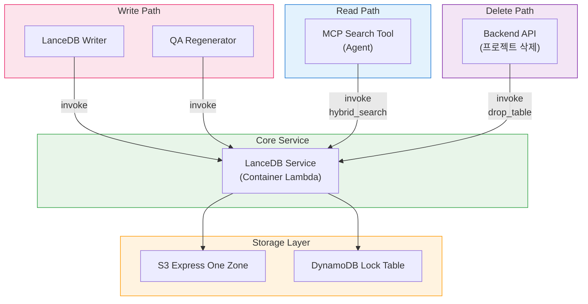

## 개요

이 프로젝트는 Amazon OpenSearch Service 대신 [LanceDB](https://lancedb.com/)를 벡터 데이터베이스로 사용합니다. LanceDB는 오픈소스 서버리스 벡터 데이터베이스로, 데이터를 S3에 직접 저장하며 별도의 클러스터 인프라가 필요 없습니다. 여기에 한국어 형태소 분석기 [Kiwi](https://github.com/bab2min/Kiwi)를 결합하여 한국어 문서에 대한 하이브리드 검색(벡터 + 전문 검색)을 구현합니다.

### 다국어 검색 지원

| 언어 | 시멘틱 검색 (벡터) | 전문 검색 (FTS) | 검색 모드 |
|------|:---:|:---:|------|
| **한국어** | O | O | 하이브리드 (벡터 + FTS) |
| **영어 및 기타 언어** | O | X | 시멘틱 검색 전용 |

Kiwi는 한국어 전용 형태소 분석기이므로, 한국어 문서에서만 FTS 키워드가 정확하게 추출됩니다. 영어 등 다른 언어의 문서는 Bedrock Nova 벡터 임베딩을 통한 시멘틱 검색으로 검색됩니다. 벡터 검색은 언어에 무관하게 의미 기반으로 동작하므로, 모든 언어의 문서를 검색할 수 있습니다.

### PoC에 LanceDB를 선택한 이유

이 프로젝트는 **PoC/프로토타입**이며, 비용 효율성이 핵심 요소입니다.

| 항목 | OpenSearch Service | LanceDB (S3) |
|------|-------------------|---------------|
| 인프라 | 전용 클러스터 (최소 2~3 노드) | 클러스터 불필요 (서버리스) |
| 유휴 비용 | 미사용 시에도 과금 | S3 스토리지 비용만 발생 |
| 설정 복잡도 | 도메인 구성, VPC, 접근 정책 | S3 버킷 + DynamoDB 잠금 테이블 |
| 스케일링 | 노드 스케일링 필요 | S3와 함께 자동 확장 |
| 예상 월 비용 (PoC) | $200~500+ (t3.medium x2 최소) | $1~10 (S3 + DDB 온디맨드) |

:::note
OpenSearch는 대시보드, k-NN 플러그인, 세분화된 접근 제어 등 프로덕션 워크로드에 적합한 풍부한 기능을 제공합니다. 전환 가이드는 [OpenSearch 마이그레이션](#opensearch-마이그레이션)을 참고하세요.
:::

---

## 아키텍처

```
쓰기 경로:
  Analysis Finalizer → SQS (Write Queue) → LanceDB Writer Lambda
    → LanceDB Service Lambda (Container)
        ├─ Kiwi: 키워드 추출
        ├─ Bedrock Nova: 벡터 임베딩 (1024d)
        └─ LanceDB: S3 Express One Zone에 저장

읽기 경로:
  MCP Search Tool Lambda
    → LanceDB Service Lambda (Container): 하이브리드 검색 (벡터 + FTS)
    → Bedrock Claude Haiku: 검색 결과 요약

삭제 경로:
  Backend API (프로젝트 삭제)
    → LanceDB Service Lambda: drop_table
```

### 스토리지 구조

```
S3 Express One Zone (Directory Bucket)
  └─ idp-v2/
      ├─ {project_id_1}/     ← 프로젝트당 하나의 LanceDB 테이블
      │   ├─ data/
      │   └─ indices/
      └─ {project_id_2}/
          ├─ data/
          └─ indices/

DynamoDB (Lock Table)
  PK: base_uri  |  SK: version
  └─ LanceDB 테이블 동시 접근 관리
```

---

## 구성 요소

### 1. LanceDB Service Lambda (Container Image)

벡터 DB 핵심 서비스입니다. `lancedb`와 `kiwipiepy`의 합산 크기가 Lambda 배포 제한(250MB)을 초과하기 때문에 Docker 컨테이너 이미지를 사용합니다.

| 항목 | 값 |
|------|-----|
| 함수 이름 | `idp-v2-lancedb-service` |
| 런타임 | Python 3.12 (Container Image) |
| 메모리 | 2048 MB |
| 타임아웃 | 5분 |
| 베이스 이미지 | `public.ecr.aws/lambda/python:3.12` |
| 의존성 | `lancedb>=0.26.0`, `kiwipiepy>=0.22.0`, `boto3` |

**지원 액션:**

| 액션 | 설명 |
|------|------|
| `add_record` | QA 레코드 추가 (키워드 추출 + 임베딩 + 저장) |
| `delete_record` | QA ID 또는 세그먼트 ID로 삭제 |
| `get_segments` | 워크플로우의 모든 세그먼트 조회 |
| `get_by_segment_ids` | 세그먼트 ID 목록으로 본문 조회 (Graph MCP에서 사용) |
| `hybrid_search` | 하이브리드 검색 (벡터 + FTS, `query_type='hybrid'`) |
| `list_tables` | 전체 프로젝트 테이블 목록 |
| `count` | 프로젝트 테이블의 레코드 수 조회 |
| `delete_by_workflow` | 워크플로우 ID로 전체 레코드 삭제 |
| `drop_table` | 프로젝트 테이블 전체 삭제 |

**Container Lambda를 사용하는 이유:**

Kiwi의 한국어 언어 모델 파일과 LanceDB의 네이티브 바이너리를 합치면 수백 MB에 달하여, Lambda의 250MB zip 제한을 초과합니다. Docker 컨테이너 이미지(최대 10GB)를 사용하면 이 제약을 해결할 수 있습니다.

### 2. LanceDB Writer Lambda

분석 파이프라인에서 쓰기 요청을 받아 LanceDB Service에 위임하는 SQS 소비자입니다.

| 항목 | 값 |
|------|-----|
| 함수 이름 | `idp-v2-lancedb-writer` |
| 런타임 | Python 3.14 |
| 메모리 | 256 MB |
| 타임아웃 | 5분 |
| 트리거 | SQS (`idp-v2-lancedb-write-queue`) |
| 동시성 | 1 (순차 처리) |

동시성을 1로 설정하여 LanceDB 테이블에 대한 동시 쓰기 충돌을 방지합니다.

### 3. MCP Search Tool

AI 채팅 중 에이전트가 문서를 검색할 때 LanceDB Service Lambda를 직접 호출하는 MCP 도구입니다.

```
사용자 질의 → Bedrock Agent Core → MCP Gateway
  → Search Tool Lambda → LanceDB Service Lambda (hybrid_search)
    → Bedrock Claude Haiku: 검색 결과 요약 → 응답
```

| 항목 | 값 |
|------|-----|
| 스택 | McpStack |
| 런타임 | Node.js 22.x (ARM64) |
| 타임아웃 | 30초 |
| 환경변수 | `LANCEDB_FUNCTION_ARN` (SSM 경유) |

---

## 데이터 스키마

각 QA 분석 결과는 다음 스키마로 저장됩니다. 하나의 세그먼트(페이지)에 여러 QA가 존재할 수 있으므로, **QA 단위로 레코드**가 생성됩니다:

```python
class DocumentRecord(LanceModel):
    workflow_id: str            # 워크플로우 ID
    document_id: str            # 문서 ID
    segment_id: str             # "{workflow_id}_{segment_index:04d}"
    qa_id: str                  # "{workflow_id}_{segment_index:04d}_{qa_index:02d}"
    segment_index: int          # 세그먼트 페이지/챕터 번호
    qa_index: int               # QA 번호 (0부터)
    question: str               # AI가 생성한 질문
    content: str                # content_combined (임베딩 소스 필드)
    vector: Vector(1024)        # Bedrock Nova 임베딩 (벡터 필드)
    keywords: str               # Kiwi 추출 키워드 (FTS 인덱싱)
    file_uri: str               # 원본 파일 S3 URI
    file_type: str              # MIME 타입
    image_uri: Optional[str]    # 세그먼트 이미지 S3 URI
    created_at: datetime        # 생성 시각
```

- **프로젝트당 하나의 테이블**: 테이블 이름 = `project_id`
- **QA 단위 저장**: 세그먼트당 여러 QA가 각각 독립 레코드로 저장 (`qa_id`로 고유 식별)
- **`content`**: 모든 전처리 결과를 합친 텍스트 (OCR + BDA + PDF 텍스트 + AI 분석)
- **`vector`**: LanceDB 임베딩 함수로 자동 생성 (Bedrock Nova, 1024차원)
- **`keywords`**: Kiwi로 추출한 한국어 형태소 (FTS 인덱스). 한국어 외 언어는 공백 기반 토큰화

---

## Kiwi: 한국어 형태소 분석기

[Kiwi (Korean Intelligent Word Identifier)](https://github.com/bab2min/Kiwi)는 C++로 작성된 오픈소스 한국어 형태소 분석기이며, Python 바인딩(`kiwipiepy`)을 제공합니다.

### Kiwi를 사용하는 이유

LanceDB의 내장 FTS 토크나이저는 한국어를 지원하지 않습니다. 한국어는 교착어로 공백만으로 단어를 분리할 수 없습니다. 예시:

```
입력:  "인공지능 기반 문서 분석 시스템을 구축했습니다"
Kiwi:  "인공 지능 기반 문서 분석 시스템 구축"  (명사만 추출)
```

형태소 분석 없이는 "시스템"으로 검색할 때 "시스템을" 또는 "시스템에서"가 포함된 문서를 찾을 수 없습니다.

### 추출 규칙

| 품사 태그 | 설명 | 예시 |
|-----------|------|------|
| NNG | 일반 명사 | 문서, 분석, 시스템 |
| NNP | 고유 명사 | AWS, Bedrock |
| NR | 수사 | 하나, 둘 |
| NP | 대명사 | 이것, 그것 |
| SL | 외국어 | Lambda, Python |
| SN | 숫자 | 1024, 3.5 |
| SH | 한자 | |
| XSN | 접미사 | 이전 토큰에 결합 (예: 생성+형 → 생성형) |

**필터:**
- 1글자 한국어 불용어: 것, 수, 등, 때, 곳
- 1글자 외국어, 숫자, 한자는 보존

---

## 하이브리드 검색 흐름

모든 검색은 LanceDB Service Lambda에서 처리됩니다. LanceDB의 네이티브 `query_type='hybrid'`를 사용하여 벡터 검색과 전문 검색을 통합합니다.

```
검색 쿼리: "문서 분석 결과 조회"
  │
  ├─ [1] Kiwi 키워드 추출 (LanceDB Service Lambda)
  │     → "문서 분석 결과 조회"
  │
  ├─ [2] LanceDB 네이티브 하이브리드 검색
  │     → table.search(query=keywords, query_type='hybrid')
  │     → 벡터 검색 (Nova 임베딩) + 전문 검색 (FTS) 자동 병합
  │     → Top-K 결과 (_relevance_score)
  │
  └─ [3] 결과 요약 (MCP Search Tool Lambda)
        → Bedrock Claude Haiku로 검색 결과 기반 답변 생성
```

---

## 인프라 (CDK)

### S3 Express One Zone

```typescript
// StorageStack
const expressStorage = new CfnDirectoryBucket(this, 'LanceDbExpressStorage', {
  bucketName: `idp-v2-lancedb--use1-az4--x-s3`,
  dataRedundancy: 'SingleAvailabilityZone',
  locationName: 'use1-az4',
});
```

S3 Express One Zone은 한 자릿수 밀리초 지연 시간을 제공하며, 벡터 검색과 같은 빈번한 읽기/쓰기 패턴에 최적화되어 있습니다.

### DynamoDB Lock Table

```typescript
// StorageStack
const lockTable = new Table(this, 'LanceDbLockTable', {
  partitionKey: { name: 'base_uri', type: AttributeType.STRING },
  sortKey: { name: 'version', type: AttributeType.NUMBER },
  billingMode: BillingMode.PAY_PER_REQUEST,
});
```

여러 Lambda 함수가 동일한 데이터셋에 동시 접근할 때 분산 잠금을 관리합니다.

### SSM 파라미터

| 키 | 설명 |
|----|------|
| `/idp-v2/lancedb/lock/table-name` | DynamoDB 잠금 테이블 이름 |
| `/idp-v2/lancedb/express/bucket-name` | S3 Express 버킷 이름 |
| `/idp-v2/lancedb/express/az-id` | S3 Express 가용 영역 ID |
| `/idp-v2/lancedb/function-arn` | LanceDB Service Lambda 함수 ARN |

---

## 컴포넌트 의존성 맵

LanceDB에 의존하는 모든 컴포넌트를 나타낸 다이어그램입니다:



| 컴포넌트 | 스택 | 접근 유형 | 설명 |
|----------|------|-----------|------|
| **LanceDB Service** | WorkflowStack | 읽기/쓰기 | 핵심 DB 서비스 (Container Lambda) |
| **LanceDB Writer** | WorkflowStack | 쓰기 (Service 경유) | SQS 소비자, Service에 위임 |
| **Analysis Finalizer** | WorkflowStack | 쓰기 (SQS/Service 경유) | 세그먼트를 쓰기 큐로 전송, 재분석 시 삭제 |
| **QA Regenerator** | WorkflowStack | 쓰기 (Service 경유) | Q&A 세그먼트 업데이트 |
| **MCP Search Tool** | McpStack | 읽기 (Service 직접 호출) | 에이전트 문서 검색 도구 |
| **Backend API** | ApplicationStack | 삭제 (Service 경유) | 프로젝트 삭제 시 `drop_table` 호출 |

---

## OpenSearch 마이그레이션

프로덕션 환경에서 Amazon OpenSearch Service로 전환 시, 다음 컴포넌트를 수정해야 합니다.

### 교체 대상 컴포넌트

| 컴포넌트 | 현재 (LanceDB) | 변경 후 (OpenSearch) | 범위 |
|----------|----------------|---------------------|------|
| **LanceDB Service Lambda** | Container Lambda + LanceDB | OpenSearch 클라이언트 (CRUD + 검색) | 전체 교체 |
| **LanceDB Writer Lambda** | SQS → LanceDB Service 호출 | SQS → OpenSearch 인덱스 쓰기 | 호출 대상 교체 |
| **MCP Search Tool** | Lambda invoke → LanceDB Service | Lambda invoke → OpenSearch 검색 | 호출 대상 교체 |
| **StorageStack** | S3 Express + DDB 잠금 테이블 | OpenSearch 도메인 (VPC) | 리소스 교체 |

### 변경 불필요 컴포넌트

| 컴포넌트 | 이유 |
|----------|------|
| **Analysis Finalizer** | SQS에 메시지만 전송 (큐 인터페이스 불변) |
| **Frontend** | DB 직접 접근 없음 |
| **Step Functions Workflow** | LanceDB 직접 의존성 없음 |

### 마이그레이션 전략

```
Phase 1: 스토리지 계층 교체
  - VPC 내에 OpenSearch 도메인 생성
  - StorageStack 리소스 교체 (S3 Express + DDB 잠금 제거)
  - 한국어 토큰화를 위한 Nori 분석기 설정

Phase 2: 쓰기 경로 교체
  - LanceDB Service → OpenSearch 인덱싱 서비스로 변경
  - 문서 스키마 변경 (OpenSearch 인덱스 매핑)
  - 임베딩을 위한 OpenSearch neural ingest pipeline 추가

Phase 3: 읽기 경로 교체
  - MCP Search Tool의 Lambda invoke 대상을 OpenSearch 검색 서비스로 변경
  - Kiwi 의존성 제거 (Nori가 한국어 토큰화 처리)

Phase 4: LanceDB 의존성 제거
  - requirements에서 lancedb, kiwipiepy 제거
  - Container Lambda 제거 (일반 Lambda로 전환 가능)
  - S3 Express 버킷 및 DDB 잠금 테이블 제거
```

### 주요 고려 사항

| 항목 | 내용 |
|------|------|
| 한국어 토큰화 | OpenSearch에는 [Nori 분석기](https://opensearch.org/docs/latest/analyzers/language-analyzers/#korean-nori)가 내장되어 있어 Kiwi 제거 가능 |
| 벡터 검색 | OpenSearch k-NN 플러그인 (HNSW/IVF)이 LanceDB 벡터 검색을 대체 |
| 임베딩 | OpenSearch neural search로 ingest pipeline에서 자동 임베딩 가능, 또는 사전 계산된 임베딩 사용 |
| 비용 | OpenSearch는 실행 중인 클러스터 필요. HA를 위한 최소 2노드 클러스터 |
| SQS 인터페이스 | SQS 쓰기 큐 패턴은 유지 가능, 소비자 로직만 변경 |
