# Diagram creation with Mermaid

## Execution Rules

- **Return Mermaid code directly** — do NOT render to PNG or SVG. The frontend handles rendering.
- Wrap the Mermaid code in a fenced code block with the `mermaid` language tag.

### Workflow

1. Understand what the user wants to visualize.
2. Choose the appropriate diagram type.
3. Write valid Mermaid syntax.
4. Return the Mermaid code in a fenced code block:

````
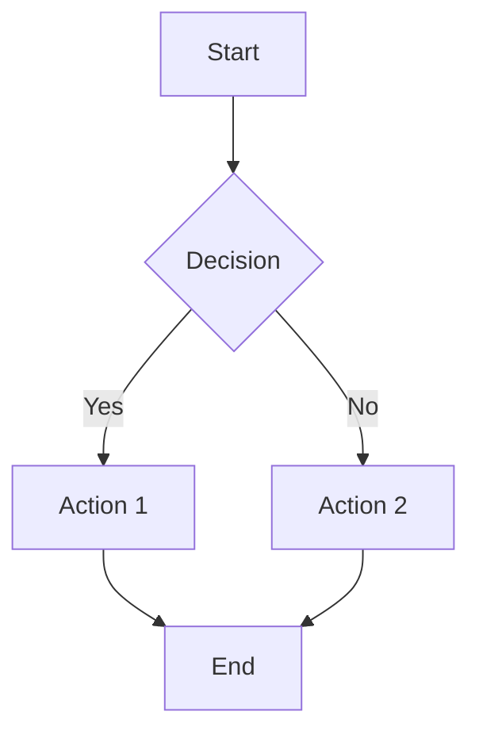
````

---

## Diagram Types

### Flowchart

Best for: processes, decision trees, workflows, algorithms.

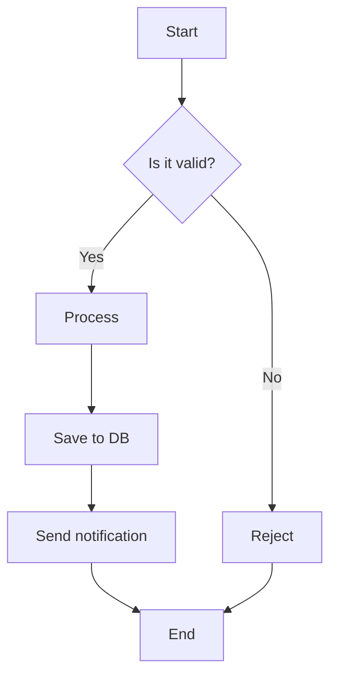

**Direction options:** `TD` (top-down), `LR` (left-right), `BT` (bottom-top), `RL` (right-left)

**Node shapes:**
```
[Rectangle]       — standard process
{Diamond}         — decision
([Stadium])       — terminal/start/end
[[Subroutine]]    — subprocess
[(Cylinder)]      — database
((Circle))        — connector
>Asymmetric]      — input/output
{Hexagon}         — preparation
```

**Link styles:**
```
A --> B           — solid arrow
A --- B           — solid line (no arrow)
A -.-> B          — dotted arrow
A ==> B           — thick arrow
A -->|label| B    — arrow with label
```

### Sequence Diagram

Best for: API flows, system interactions, request/response patterns, protocol exchanges.

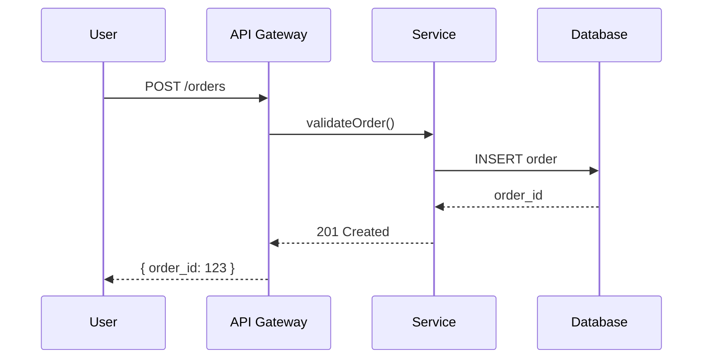

**Arrow types:**
```
->>    solid arrow (sync request)
-->>   dotted arrow (async response)
-x     solid with X (failed/rejected)
--x    dotted with X
-)     solid open arrow
--)    dotted open arrow
```

**Features:**
```
Note right of A: Note text         — side note
Note over A,B: Shared note         — spanning note
alt condition                       — if/else
    A->>B: action
else other
    A->>B: other action
end
loop Every 5 min                    — loop
    A->>B: poll
end
par Parallel                        — parallel execution
    A->>B: task 1
and
    A->>C: task 2
end
rect rgb(200, 220, 255)             — highlight region
    A->>B: important step
end
```

### Class Diagram

Best for: object models, data structures, system design.

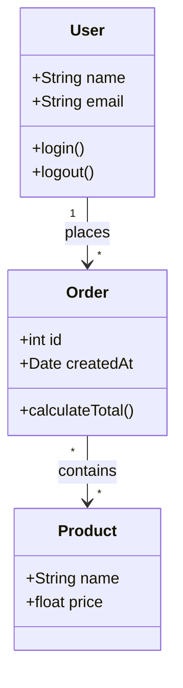

**Relationships:**
```
A <|-- B    inheritance
A *-- B     composition
A o-- B     aggregation
A --> B     association
A ..> B     dependency
A ..|> B    realization
```

**Cardinality:** `"1"`, `"0..1"`, `"*"`, `"1..*"`, `"0..*"`

### Entity Relationship (ER) Diagram

Best for: database schemas, data models.

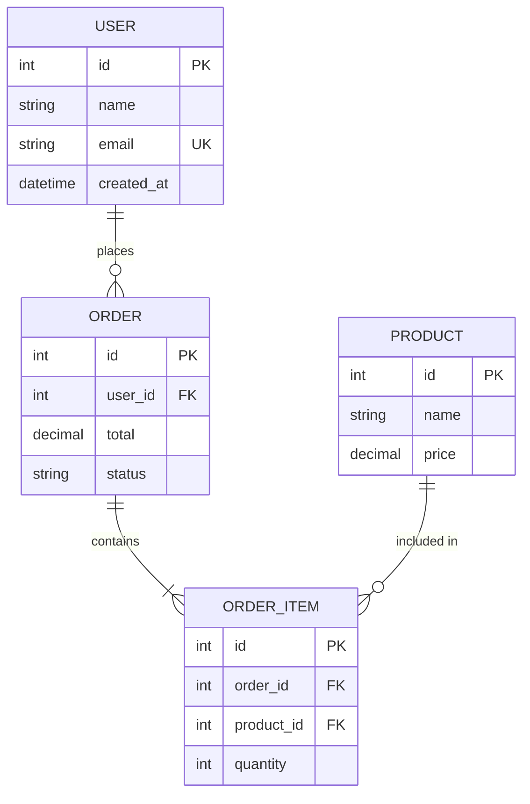

**Relationship notation:**
```
||--||    one to one
||--o{    one to zero-or-many
||--|{    one to one-or-many
o{--o{    many to many
```

### Gantt Chart

Best for: project timelines, sprint planning, milestones.

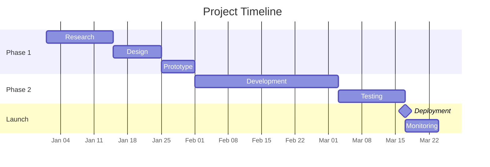

**Task types:**
```
Task name    :id, start_date, duration     — normal task
Task name    :active, id, start, duration  — active (highlighted)
Task name    :done, id, start, duration    — completed
Task name    :crit, id, start, duration    — critical path
Task name    :milestone, after id, 0d      — milestone
```

### State Diagram

Best for: state machines, status flows, lifecycle models.

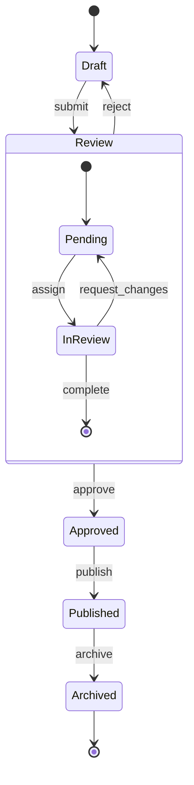

### Mindmap

Best for: brainstorming, topic hierarchies, concept maps.

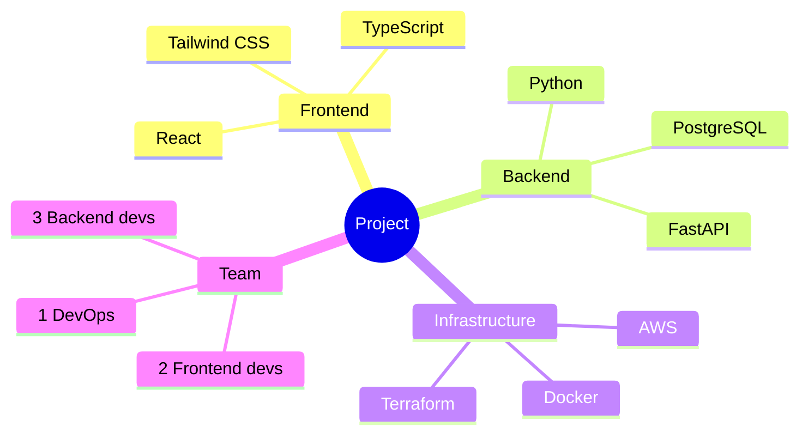

### Timeline

Best for: historical events, version history, roadmaps.

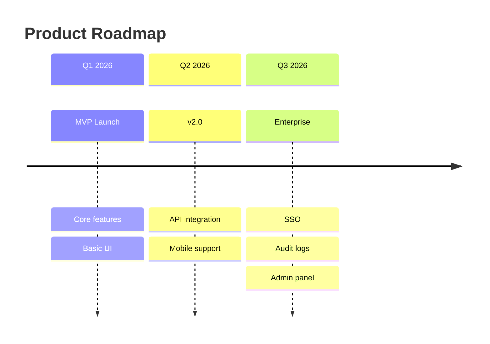

---

## Styling

### Built-in Themes

Apply themes using the `init` directive at the top of the diagram:

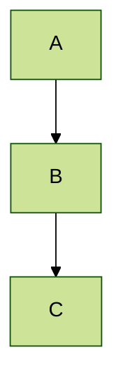

| Theme | Description |
|-------|-------------|
| `default` | Clean, standard colors |
| `forest` | Green tones, organic feel |
| `dark` | Dark background, light text |
| `neutral` | Grayscale, minimal |

### Custom Styling (classDef)

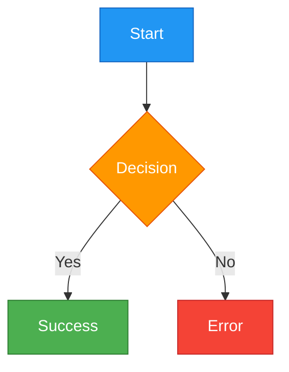

### Custom Theme Variables

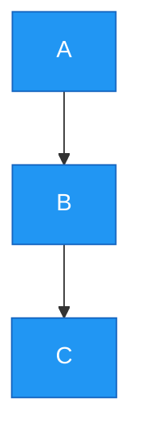

---

## Common Pitfalls

- **Keep diagrams focused** — split complex systems into multiple diagrams rather than one massive diagram
- **Test syntax incrementally** — Mermaid syntax errors are hard to debug in large diagrams
- **Use `participant` aliases** in sequence diagrams — `participant U as User` keeps the diagram readable
- **Direction matters** — `LR` (left-right) works better for wide processes, `TD` (top-down) for hierarchical structures
- **Quote special characters** — labels with special characters need quotes: `A["Label with (parens)"]`
- **Escape hash in labels** — use `#35;` instead of `#` inside node labels
- **No empty lines inside diagram** — Mermaid may break on unexpected blank lines within a diagram block

---

## Dependencies

None. Mermaid code is returned as text — the frontend handles rendering.
